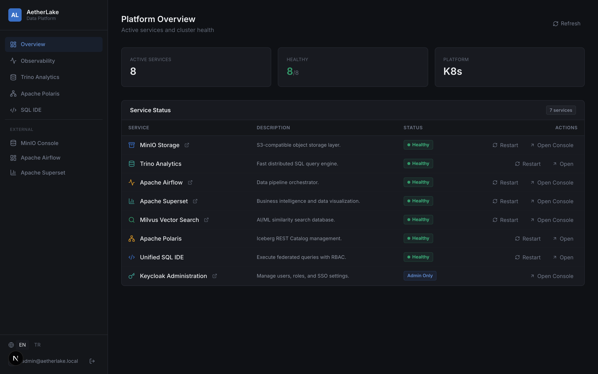
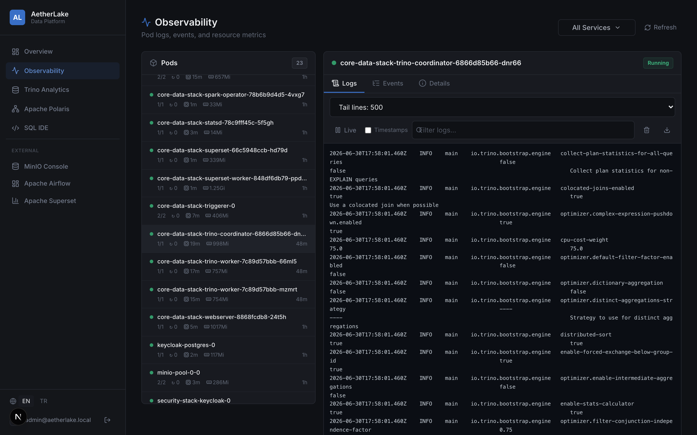
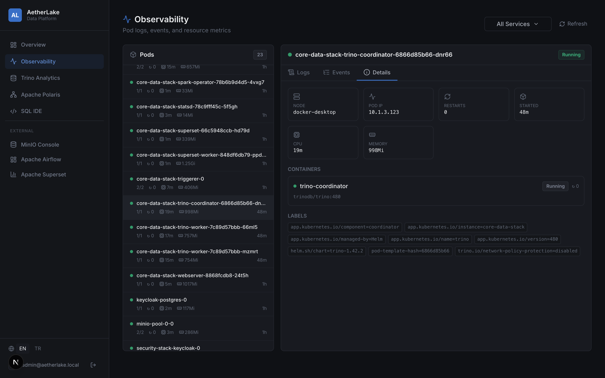
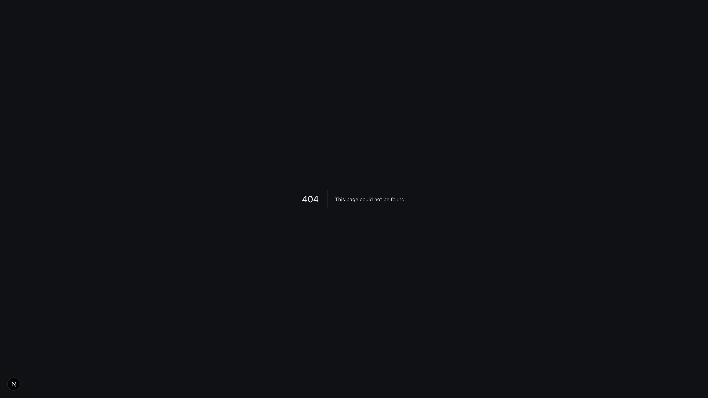
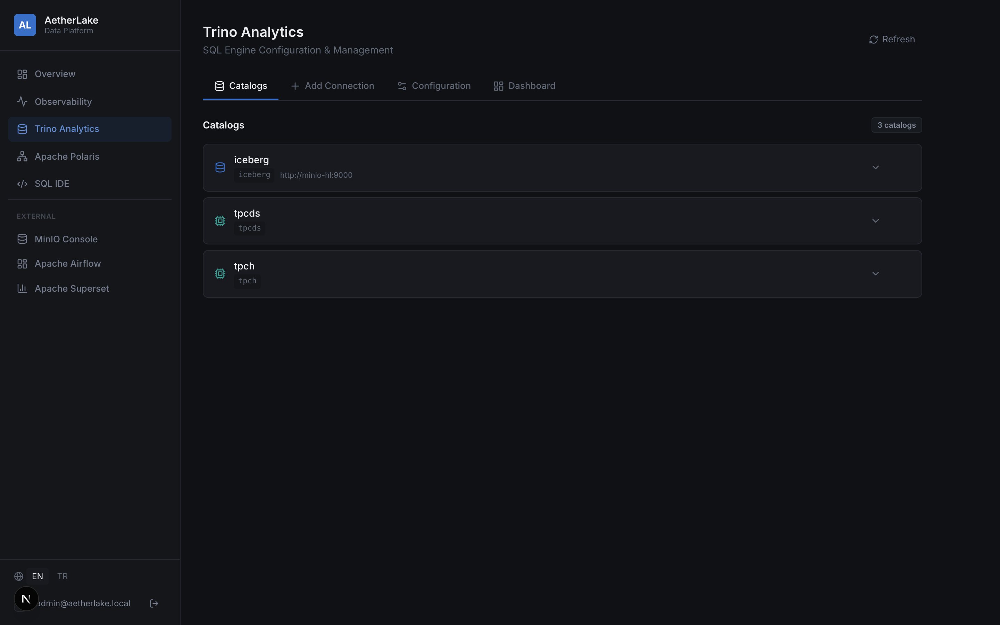

<p align="center">
  
  
  
  
  
  
</p>

<h1 align="center">⚡ AetherLake: Open-Source Data Lakehouse on Kubernetes</h1>

<p align="center">
  # 🌊 AetherLake

  

  AetherLake is a Kubernetes-native open-source Data Lakehouse platform. It orchestrates storage, query, vector search, and AI orchestration engines to build a unified modern data stack. with a single <code>helm install</code>.
</p>

<p align="center">
  <a href="#-quick-start">Quick Start</a> ·
  <a href="#-architecture">Architecture</a> ·
  <a href="#-components">Components</a> ·
  <a href="#-control-panel">Control Panel</a> ·
  <a href="#-configuration">Configuration</a> ·
  <a href="#-contributing">Contributing</a>
</p>

---

## ✨ What is AetherLake?

AetherLake is a **batteries-included, Kubernetes-native Data Lakehouse** that brings together best-in-class open-source tools into a single, cohesive platform. Instead of spending weeks gluing together storage, compute, catalog, orchestration, and security layers — deploy everything in minutes.

**Key principles:**

- 🏗️ **Modular** — Enable or disable any component via a single toggle
- 🔐 **Secure by default** — Centralized SSO with Keycloak, RBAC across all services
- 📦 **Cloud-native** — Helm charts, Kubernetes operators, and S3-compatible storage
- 🎛️ **Unified control** — Web-based Control Panel to manage the entire platform
- 🌐 **Multi-language** — Control Panel supports English and Turkish (extensible)

---

## 🏛️ Architecture

```
┌──────────────────────────────────────────────────────────────────────┐
│                      aetherlake namespace                            │
│                                                                      │
│  ┌─────────────┐  ┌─────────────┐  ┌─────────────┐  ┌────────────┐ │
│  │   MinIO      │  │   Trino     │  │  Polaris    │  │  Milvus    │ │
│  │  (Storage)   │  │  (SQL)      │  │ (Catalog)   │  │ (Vector)   │ │
│  │  S3-compat   │  │  Federated  │  │  Iceberg    │  │  AI/ML     │ │
│  │  Object      │  │  Query      │  │  REST       │  │  Similarity│ │
│  └──────┬───────┘  └──────┬──────┘  └──────┬──────┘  └─────┬──────┘ │
│         │                 │                │               │        │
│         └─────────────────┼────────────────┘               │        │
│                           │                                │        │
│  ┌────────────────────────┼────────────────────────────────┘        │
│  │                        │                                         │
│  │  ┌─────────────┐  ┌───┴─────────┐  ┌──────────────┐            │
│  │  │  Airflow     │  │  Spark      │  │  Superset    │            │
│  │  │ (Orchestr.)  │  │ (Process.)  │  │  (BI / dbt)  │            │
│  │  └──────────────┘  └─────────────┘  └──────────────┘            │
│  │   Airflow/Superset/Polaris → shared aetherlake-postgres          │
│  │   Keycloak → its own keycloak-postgres (isolated)               │
│  │                                                                  │
│  │  ┌───────────────────────────────────────────────────┐          │
│  │  │              Control Panel (Next.js)               │          │
│  │  │ Status · Observability · Catalogs · SQL IDE · i18n │          │
│  │  └───────────────────────────────────────────────────┘          │
│  │                                                                  │
│  │  ┌───────────────────────────────────────────────────┐          │
│  │  │              Keycloak (Identity & SSO)             │          │
│  │  │  OIDC · RBAC · Realm: aetherlake · Multi-client   │          │
│  │  └───────────────────────────────────────────────────┘          │
│  │                                                                  │
│  └─────────────── Nginx Ingress Controller ─────────────────────── │
│                                                                      │
│  DNS: *.aetherlake.local                                            │
│  minio | trino | polaris | keycloak | airflow | superset | milvus   │
└──────────────────────────────────────────────────────────────────────┘
```

---

## 📦 Components

> Detailed per-component reference (every setting, architecture diagrams,
> operational notes) lives in the **[documentation site](https://mrtozkl.github.io/AetherLake/)** under *Component Reference*.

| Component | Role | Version | Status |
|-----------|------|---------|--------|
| **[Keycloak](https://www.keycloak.org/)** | Identity & SSO (OIDC) | Upstream 26.3.3 | ✅ Stable |
| **[MinIO](https://min.io/)** | S3-compatible object storage | Operator Tenant (2025-04) | ✅ Stable |
| **[Trino](https://trino.io/)** | Distributed SQL query engine | 480 (chart 1.42.2) | ✅ Stable |
| **[Apache Polaris](https://polaris.apache.org/)** | Iceberg REST catalog + vending | Postgres metastore | ✅ Stable |
| **[Apache Airflow](https://airflow.apache.org/)** | Workflow orchestration | Apache 2.10.5 (chart 1.16.0) | ✅ Stable |
| **[Apache Superset](https://superset.apache.org/)** | BI & dashboards | 3.1.2 (chart 0.12.8) | ✅ Stable |
| **[Apache Spark](https://spark.apache.org/)** | Distributed data processing | Operator 1.1.27 | ✅ Stable |
| **[Milvus](https://milvus.io/)** | Vector similarity search | chart 5.0.14 | ✅ Stable |
| **[PostgreSQL](https://www.postgresql.org/)** | Metadata datastore (shared + Keycloak) | 16-alpine | ✅ Stable |
| **[dbt](https://www.getdbt.com/)** | SQL-based data transformation | Project included | ✅ Stable |
| **Control Panel** | Web UI for platform management | Next.js 16 | ✅ Stable |

---

## 🚀 Quick Start

### Prerequisites

- Kubernetes cluster (v1.26+) — local: [Docker Desktop](https://www.docker.com/products/docker-desktop/), [minikube](https://minikube.sigs.k8s.io/), or [kind](https://kind.sigs.k8s.io/)
- [Helm](https://helm.sh/) v3.12+
- [kubectl](https://kubernetes.io/docs/tasks/tools/)
- NGINX Ingress Controller
- *(optional)* [metrics-server](https://github.com/kubernetes-sigs/metrics-server) — required for the Control Panel's per-pod CPU/RAM metrics. On Docker Desktop install it with `--kubelet-insecure-tls`.

### 1. Clone the repository

```bash
git clone https://github.com/mrtozkl/AetherLake.git
cd AetherLake
```

### 2. Run the installer

The installation script automates namespace creation, credential generation, and Helm deployments:

```bash
./install.sh
```

This will deploy Keycloak, MinIO, Trino, Polaris, and all other configured components into your local cluster.

### 6. Configure local DNS

Add the following to your `/etc/hosts` (or use a local DNS resolver):

```
127.0.0.1  minio.aetherlake.local
127.0.0.1  trino.aetherlake.local
127.0.0.1  polaris.aetherlake.local
127.0.0.1  keycloak.aetherlake.local
127.0.0.1  airflow.aetherlake.local
127.0.0.1  milvus.aetherlake.local
127.0.0.1  superset.aetherlake.local
```

### 7. Access the platform

| Service | URL |
|---------|-----|
| Control Panel | `http://localhost:3000` |
| MinIO Console | `http://minio.aetherlake.local` |
| Trino | `http://trino.aetherlake.local` |
| Polaris | `http://polaris.aetherlake.local` |
| Keycloak | `http://keycloak.aetherlake.local` |
| Airflow | `http://airflow.aetherlake.local` |
| Superset | `http://superset.aetherlake.local` |
| Milvus (Attu) | `http://milvus.aetherlake.local` |

**Control Panel (local dev login):** `admin` / `admin` — this username/password
provider is only enabled when the Control Panel runs outside production
(`NODE_ENV !== "production"`); deployments use Keycloak SSO.

**Keycloak admin & service credentials** are randomly generated by `install.sh`.
Retrieve them from the cluster secret, e.g. the Keycloak admin password:

```bash
kubectl get secret aetherlake-credentials -n aetherlake \
  -o jsonpath='{.data.keycloak-admin-password}' | base64 -d
```

---

## 🎛️ Control Panel


The Control Panel is a **Next.js 16** web application that serves as the unified management interface for the entire platform.

### Features

- **Platform Overview** — Real-time pod status monitoring with auto-refresh
- **Observability** — Pod log viewer (live tail), Kubernetes events, and per-pod CPU/RAM metrics
- **Trino Management** — Create, delete, and configure SQL catalogs (Iceberg, Hive, PostgreSQL, MySQL)
- **Polaris Management** — Manage Iceberg REST catalogs and namespaces
- **SQL IDE** — Browser-based SQL editor with Monaco Editor, schema explorer, and query results
- **Service Actions** — Restart services directly from the dashboard
- **SSO Integration** — Keycloak OIDC and credentials-based authentication
- **Internationalization** — English and Turkish support with runtime switching
- **Role-Based Access** — Admin-only features (Keycloak management)

### Screenshots

| Observability — live pod logs | Observability — metrics & details |
|---|---|
|  |  |

| Unified SQL IDE | Trino catalogs |
|---|---|
|  |  |

### Running locally

```bash
cd control-panel
npm install
npm run dev
# → http://localhost:3000
```

### Docker build

```bash
cd control-panel
docker build -t aetherlake-control-panel .
docker run -p 3000:3000 aetherlake-control-panel
```

---

## 🤖 MCP Server (For AI Assistants)

AetherLake includes a built-in **Model Context Protocol (MCP)** server, allowing AI assistants like Claude, Cursor, or Windsurf to directly interact with your data platform.

### Supported Tools

- `get_platform_status`: Check the health of all AetherLake components.
- `get_service_logs`: Fetch real-time logs from any service (e.g., Trino, Airflow).
- `restart_service`: Safely restart a specific component.
- `query_trino`: Execute SQL queries against your Data Lakehouse.
- `list_catalogs`: View Iceberg catalogs via Apache Polaris.
- `list_airflow_dags` / `trigger_airflow_dag`: Manage your data pipelines.

### Configuring Claude Desktop

Add the following to your `claude_desktop_config.json`:

```json
{
  "mcpServers": {
    "aetherlake": {
      "command": "node",
      "args": ["/path/to/AetherLake/mcp-server/dist/index.js"],
      "env": {
        "AETHERLAKE_NAMESPACE": "aetherlake",
        "TRINO_URL": "http://trino.aetherlake.local",
        "POLARIS_URL": "http://polaris.aetherlake.local",
        "AIRFLOW_URL": "http://airflow.aetherlake.local",
        "AIRFLOW_AUTH": "admin:your-airflow-password"
      }
    }
  }
}
```

> ⚠️ `AIRFLOW_AUTH` (format `user:password`) defaults to `admin:admin` for local
> development. Set it to real credentials before pointing the MCP server at any
> non-local deployment.

Make sure to run `npm install` and `npm run build` in the `mcp-server` directory first.

---

## 📁 Project Structure

```
AetherLake/
├── control-panel/              # Next.js Control Panel web application
│   ├── src/app/
│   │   ├── page.tsx            # Platform overview (home)
│   │   ├── trino/              # Trino catalog management
│   │   ├── polaris/            # Polaris catalog management
│   │   ├── query/              # SQL IDE with Monaco Editor
│   │   ├── api/                # Backend API routes (K8s, Trino, Polaris)
│   │   ├── components/         # Shared UI components (Sidebar)
│   │   ├── i18n.ts             # Translation strings (EN/TR)
│   │   └── locale-provider.tsx # React context for i18n
│   └── Dockerfile
│
├── helm-charts/
│   ├── core-data-stack/        # Main data infrastructure chart
│   │   ├── Chart.yaml          # Dependencies: Trino, Spark, Polaris, Airflow, Milvus
│   │   ├── values.yaml         # Default configuration
│   │   ├── charts/polaris/     # Custom Apache Polaris subchart
│   │   └── templates/          # MinIO Tenant CRD, init jobs
│   │
│   └── security-stack/         # Identity & access management chart
│       ├── Chart.yaml          # Dependency: Keycloak
│       └── values.yaml         # Realm config, OIDC clients, RBAC roles
│
├── pipelines/                  # Data pipeline examples
│   ├── airflow/dags/           # Airflow DAG definitions
│   ├── spark/ingest.py         # PySpark ingestion job
│   └── dbt/                    # dbt project (models, profiles)
│
├── aetherlake-ingress.yaml     # NGINX Ingress rules for all services
└── README.md
```

---

## ⚙️ Configuration

### Component toggles

Each component can be individually enabled or disabled in `values.yaml`:

```yaml
minio:
  enabled: true

trino:
  enabled: true
  server:
    workers: 2      # Scale Trino workers

polaris:
  enabled: true

spark-operator:
  enabled: true

airflow:
  enabled: false    # Disable if not needed

milvus:
  enabled: true

keycloak:
  enabled: true
```

### Secrets management

All credentials are managed through a single Kubernetes Secret (`aetherlake-credentials`), referenced by all components:

```yaml
global:
  existingSecret: "aetherlake-credentials"
```

The Control Panel can dynamically provision and rotate secrets via the Kubernetes API.

### Storage configuration

MinIO is deployed as an AIStor Tenant via the MinIO Operator:

```yaml
minio:
  servers: 1
  volumesPerServer: 1
  storageSize: "20Gi"
  storageClassName: "hostpath"
  initBuckets:
    - "lakehouse"
    - "milvus-vectors"
```

### SSO / OIDC

Keycloak is pre-configured with the `aetherlake` realm and OIDC clients for all services:

| Client | Service |
|--------|---------|
| `aetherlake-client` | Control Panel |
| `trino` | Trino SQL Engine |
| `airflow` | Apache Airflow |
| `polaris` | Apache Polaris |
| `minio` | MinIO Console |

RBAC roles: `data-admin`, `data-scientist`, `data-engineer`

---

## 🔧 Data Pipelines

### Spark

Submit PySpark jobs via the Spark Operator:

```bash
kubectl apply -f pipelines/spark/ingest.py
```

### dbt

Run transformations against Trino:

```bash
cd pipelines/dbt
dbt run --profiles-dir .
```

### Airflow

DAGs are located in `pipelines/airflow/dags/` and synced to Airflow via Git or ConfigMap.

---

## 🗺️ Roadmap

- [ ] Terraform / Pulumi IaC modules for cloud deployment
- [ ] Grafana + Prometheus observability stack
- [ ] Apache Ranger for fine-grained data access policies
- [ ] Data catalog UI with lineage visualization
- [ ] Multi-cluster federation
- [ ] GitOps deployment with ArgoCD
- [ ] Automated backup and disaster recovery
- [ ] Helm chart published to artifact registry

---

## 🚨 Security & Production Readiness

AetherLake is designed to be easy to run locally. `install.sh` now generates the
cluster credentials (`aetherlake-credentials` / `open-lake-credentials`) with
**random per-install values**, and the Control Panel **refuses to start in
production without `NEXTAUTH_SECRET` and `KEYCLOAK_CLIENT_SECRET`** set. Some
chart `values.yaml` files still carry placeholder defaults, so review them before
exposing a cluster.

> [!WARNING]
> Before exposing your AetherLake cluster to a public or production environment, you **MUST**:
> 1. Review remaining placeholder secrets in the chart `values.yaml` files and override any that still reference dummy values. (`helm-charts/security-stack/secrets.yaml` ships only `CHANGE_ME` placeholders and is not used by the default install path.)
> 2. Set `NEXTAUTH_SECRET` and `KEYCLOAK_CLIENT_SECRET` as environment variables for the Control Panel — in production these have no fallback and the app will fail to start without them.
> 3. Override `AIRFLOW_AUTH` for the MCP server (defaults to `admin:admin`).
> 4. Use proper TLS certificates on the NGINX Ingress Controller.

---

## 🤝 Contributing

Contributions are welcome! Whether it's a bug fix, new feature, or documentation improvement.

1. Fork the repository
2. Create your feature branch (`git checkout -b feature/amazing-feature`)
3. Commit your changes (`git commit -m 'Add amazing feature'`)
4. Push to the branch (`git push origin feature/amazing-feature`)
5. Open a Pull Request

Please make sure your changes:
- Pass `helm lint` for chart changes
- Pass `npm run build` for Control Panel changes
- Include appropriate documentation updates

---

## 📄 License

This project is licensed under the **Apache License 2.0** — see the [LICENSE](LICENSE) file for details.

---

<p align="center">
  <sub>Built with ❤️ for the open-source data community</sub>
</p>
