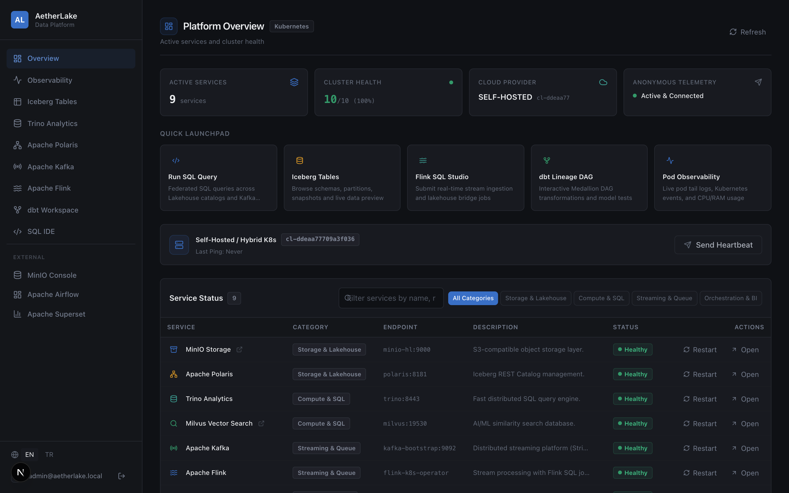

<p align="center">
  
  
  
  
  
  
  
</p>

<h1 align="center">🌊 AetherLake — Open-Source Data Lakehouse on Kubernetes</h1>

<p align="center">
  
</p>

<p align="center">
  Storage, catalog, query, streaming, BI and identity — one <code>helm install</code>.<br/>
  <a href="#-quick-start">Quick Start</a> · <a href="#-components">Components</a> · <a href="#-streaming-kafka--flink">Streaming</a> · <a href="#-single-sign-on">SSO</a> · <a href="#-configuration">Configuration</a>
</p>

---

## ✨ What is AetherLake?

A batteries-included, Kubernetes-native data lakehouse that glues best-in-class
open-source components into one platform: S3 storage, an Iceberg REST catalog,
federated SQL, stream processing, orchestration, BI and centralized identity —
managed from a single web Control Panel.

- 🏗️ **Modular** — every component behind a single `values.yaml` toggle
- 🔐 **Secure by default** — Keycloak SSO for every UI, random per-install secrets
- 🌊 **Streaming** — Kafka (Strimzi) + Flink SQL jobs, queryable from Trino
- 🎛️ **Unified control** — Next.js Control Panel (EN/TR) for status, SQL, catalogs, Kafka and Flink

---

## 🏛️ Architecture

```
                        *.aetherlake.local (nginx ingress)
                        │  oauth2-proxy gate (Keycloak SSO)
                        │  for UIs without native OIDC
   ┌────────────────────┼───────────────────────────────────────┐
   │  aetherlake ns     ▼                                       │
   │  ┌──────────┐ ┌──────────┐ ┌──────────┐ ┌───────────────┐ │
   │  │ MinIO    │ │ Trino    │ │ Polaris  │ │ Control Panel │ │
   │  │ storage  │◄ SQL +    │ │ Iceberg  │ │ Next.js (SSO) │ │ │
   │  │          │ │ kafka cat│ │ REST cat │ └───────────────┘ │ │
   │  └──────────┘ └────▲─────┘ └──────────                   │ │
   │                    │ queries                              │ │
   │  ┌────────── ┌────┴─────┐ ┌──────────┐ ┌───────────────┐ │ │
   │  │ Kafka    │◄ Flink    │ │ Airflow  │ │ Superset (SSO)│ │ │
   │  │ Strimzi  │ │ SQL jobs │ │ (SSO)    │ │ Milvus/Attu   │ │ │
   │  │ +external│ └────────── └──────────┘ └───────────────┘ │ │
   │  │ SCRAM    │                                             │ │
   │  └──────────┘ ┌─────────────────────────────────────────┐ │ │
   │               │ Keycloak — realm aetherlake, OIDC SSO   │ │ │
   │               └─────────────────────────────────────────┘ │ │
   └────────────────────────────────────────────────────────────┘
```

Per-component deep dives (settings, diagrams, operations) live in
[`docs/guide/components/`](docs/guide/components/).

---

## 📦 Components

| Component | Role | Version |
|-----------|------|---------|
| [Keycloak](https://www.keycloak.org/) | Identity & SSO (OIDC) | 26.3.3 |
| [MinIO](https://min.io/) | S3-compatible object storage | Operator tenant |
| [Trino](https://trino.io/) | Federated SQL (Iceberg + Kafka catalogs) | 480 |
| [Apache Polaris](https://polaris.apache.org/) | Iceberg REST catalog | Postgres metastore |
| [Apache Kafka](https://kafka.apache.org/) | Streaming (Strimzi, KRaft) | 4.3.0 |
| [Apache Flink](https://flink.apache.org/) | Stream processing (SQL jobs) | 2.1 / Operator 1.15 |
| [Apache Airflow](https://airflow.apache.org/) | Orchestration | 2.10.5 |
| [Apache Superset](https://superset.apache.org/) | BI & dashboards | 3.1.2 |
| [Apache Spark](https://spark.apache.org/) | Batch processing | Operator 1.1.27 |
| [Milvus](https://milvus.io/) | Vector search | chart 5.0.14 |
| PostgreSQL | Metadata stores | 16 |
| Control Panel | Platform UI (Next.js) | EN/TR |

---

## 🚀 Quick Start

**Prerequisites:** Kubernetes (Docker Desktop / minikube / kind), Helm ≥ 3.12,
kubectl, Docker (the installer builds the Flink SQL runner image), an NGINX
ingress controller (the installer installs one if missing).

```bash
git clone https://github.com/mrtozkl/AetherLake.git && cd AetherLake
./install.sh
```

Add local DNS entries:

```
127.0.0.1  minio.aetherlake.local trino.aetherlake.local polaris.aetherlake.local
127.0.0.1  keycloak.aetherlake.local airflow.aetherlake.local superset.aetherlake.local
127.0.0.1  milvus.aetherlake.local oauth2.aetherlake.local
```

| Service | URL | Auth |
|---------|-----|------|
| Control Panel | `http://localhost:3000` | dev login `admin`/`admin` (local dev only) |
| Trino UI | `http://trino.aetherlake.local` | Keycloak SSO |
| Milvus (Attu) | `http://milvus.aetherlake.local` | Keycloak SSO |
| MinIO Console | `http://minio.aetherlake.local` | Keycloak OIDC |
| Airflow | `http://airflow.aetherlake.local` | Keycloak OIDC |
| Superset | `http://superset.aetherlake.local` | Keycloak OIDC |
| Keycloak | `http://keycloak.aetherlake.local` | admin (secret) |

All credentials are randomly generated into `aetherlake-credentials`:

```bash
kubectl get secret aetherlake-credentials -n aetherlake \
  -o jsonpath='{.data.realm-admin-password}' | base64 -d   # SSO admin (change on first login)
```

Every host is also served over TLS with a self-signed CA (cert-manager);
plain HTTP stays on because the SSO issuer URLs are `http://`.

---

## 🎛️ Control Panel

- **Overview** — pod health, restarts, one-click service restarts; Kafka card links to the Kafka view
- **Kafka** — cluster status/version, broker health, topics (partitions, replicas, config, conditions)
- **Flink** — SQL IDE workspace: Kafka topic explorer, Monaco editor, submit/cancel jobs, live status
- **SQL IDE** — Trino queries with schema explorer (Iceberg *and* Kafka catalogs)
- **Trino / Polaris** — catalog & namespace management
- **Observability** — live logs, events, per-pod metrics
- **i18n & RBAC** — English/Turkish, admin-gated actions

```bash
cd control-panel && npm install && npm run dev   # → http://localhost:3000
```

---

## 🌊 Streaming: Kafka + Flink

Enable with `kafka.enabled` / `flink.enabled` (both default `true`).

- **Kafka** runs KRaft-mode Strimzi with a `KafkaTopic` `events`; Flink SQL jobs
  read/write it via the pre-installed Kafka connector
  (`pipelines/flink/examples/`).
- **Flink SQL jobs** are submitted from the Control Panel; each runs as an
  application-mode FlinkDeployment. The runner image is built by `install.sh`.
- **Kafka in Trino:** topics are queryable as SQL tables —
  `SELECT * FROM kafka.aetherlake.events` (schemas in
  `trino.kafka.tableDescriptions`).

### Producing from outside the cluster

The `external` listener (TLS + SCRAM-SHA-512, nodeport) accepts authenticated
clients; credentials live in the `external-producer` KafkaUser secret:

```bash
NODEPORT=$(kubectl get svc aetherlake-kafka-external-bootstrap -n aetherlake \
  -o jsonpath='{.spec.ports[0].nodePort}')
kubectl get secret aetherlake-cluster-ca-cert -n aetherlake \
  -o jsonpath='{.data.ca\.crt}' | base64 -d > cluster-ca.crt      # TLS truststore
kubectl get secret external-producer -n aetherlake \
  -o jsonpath='{.data.sasl\.jaas\.config}' | base64 -d            # sasl.jaas.config value
```

Client properties (`localhost:$NODEPORT` on Docker Desktop):

```properties
security.protocol=SASL_SSL
sasl.mechanism=SCRAM-SHA-512
sasl.jaas.config=<value from the secret>
ssl.truststore.location=<truststore built from cluster-ca.crt>
ssl.truststore.password=<truststore password>
```

Full recipe (truststore build, console producer/consumer examples):
[docs/guide/components/kafka.md](docs/guide/components/kafka.md#producing-from-outside-the-cluster).

---

## 🔐 Single Sign-On

Keycloak realm `aetherlake` with OIDC clients per service. Apps with native
OIDC (Superset, Airflow, MinIO) log in directly; UIs without one (Trino,
Milvus/Attu) are gated by **oauth2-proxy** through nginx external auth — one
Keycloak login, shared `*.aetherlake.local` session.

| Client | Used by |
|--------|---------|
| `aetherlake-client` | Control Panel (NextAuth) |
| `oauth2-proxy` | SSO gate for Trino UI & Milvus Attu |
| `superset` / `airflow` / `minio` | native OIDC apps |
| `polaris` | catalog token issuance |

Realm roles: `data-admin`, `data-scientist`, `data-engineer`.

---

## ⚙️ Configuration

Component toggles in `helm-charts/core-data-stack/values.yaml`:

```yaml
kafka:
  enabled: true
  external:            # authenticated (SCRAM) access from outside the cluster
    enabled: true
flink:
  enabled: true
trino:
  enabled: true
  server:
    workers: 2
airflow:
  enabled: false       # disable anything you don't need
```

Secrets: everything reads from `aetherlake-credentials` /
`open-lake-credentials` (random per install; re-runs backfill missing keys).
Storage: MinIO tenant (`minio.*`: servers, volumes, `initBuckets`).

---

## 🤖 MCP Server

AI assistants (Claude, Cursor, …) can operate the platform via
[`mcp-server/`](mcp-server/): platform status, service logs/restarts, Trino
queries, Polaris catalogs, Airflow DAGs. Build with
`npm install && npm run build`, then point your MCP client at
`mcp-server/dist/index.js` (see `mcp-server/README.md` for the config block).

---

## 📁 Project Structure

```
├── control-panel/        # Next.js UI (overview, kafka, flink, sql ide, …)
├── helm-charts/
│   ├── core-data-stack/  # data infra chart (+ vendored subcharts)
│   └── security-stack/   # Keycloak + realm/OIDC provisioning
├── mcp-server/           # MCP tools for AI assistants
├── pipelines/            # airflow dags, spark, flink sql-runner + examples, dbt
├── docs/                 # component reference & guides
├── aetherlake-ingress.yaml
└── install.sh
```

---

## 🗺️ Roadmap

- [ ] Terraform / Pulumi modules · Grafana + Prometheus stack
- [ ] Apache Ranger policies · lineage UI · multi-cluster federation
- [ ] GitOps (ArgoCD) · automated backups · chart on an artifact registry

---

## 🚨 Security & Production Readiness

Credentials are random per install and the Control Panel refuses to start in
production without `NEXTAUTH_SECRET` / `KEYCLOAK_CLIENT_SECRET`. Before
exposing a cluster: review placeholder values in chart `values.yaml`, set the
Control Panel env vars, override the MCP server's `AIRFLOW_AUTH`, and use real
TLS certificates on the ingress.

---

## 🤝 Contributing

Fork → branch → commit → PR. Chart changes must pass `helm lint`; Control
Panel changes must pass `npm run build`; update docs with your change.

## 📄 License

**BUSL-1.1** — free to use, modify and self-host internally; commercial
hosted/managed offerings require a license (see [LICENSE](LICENSE)). Converts
to Apache-2.0 four years after each release. Third-party components keep their
own licenses — see [THIRD_PARTY_LICENSES.md](THIRD_PARTY_LICENSES.md).
