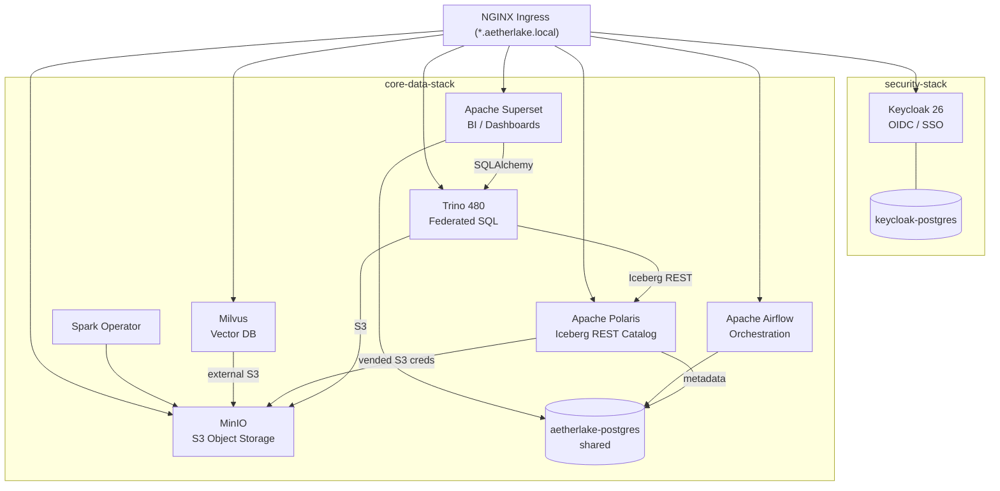
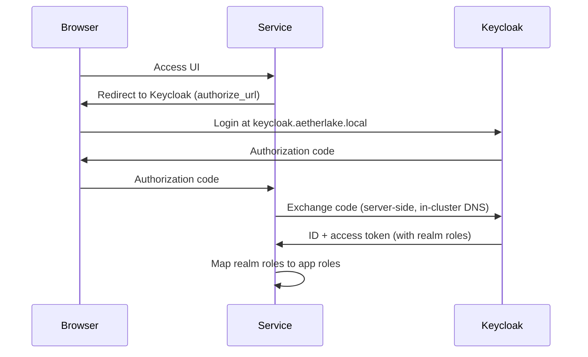
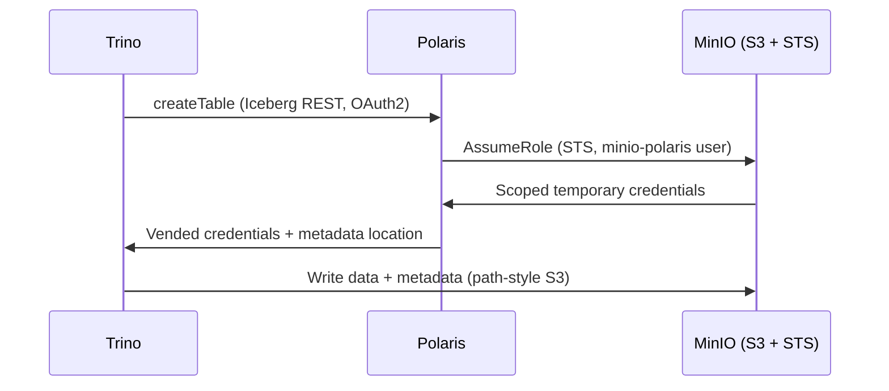

# Architecture

AetherLake is a decoupled, microservices-oriented data lakehouse running entirely
on Kubernetes. It is split into two Helm charts:

- **`security-stack`** — Keycloak (OIDC/SSO) + its PostgreSQL.
- **`core-data-stack`** — MinIO, Trino, Apache Polaris, Apache Spark, Apache
  Airflow, Apache Superset, Milvus, and the shared PostgreSQL/Redis.

## System overview

## Layers

| Layer | Component(s) | Responsibility |
|-------|--------------|----------------|
| **Identity** | Keycloak | Single sign-on, OIDC clients, realm roles |
| **Storage** | MinIO | S3-compatible object storage (Iceberg data, vectors, raw files) |
| **Catalog** | Apache Polaris | Iceberg REST catalog + S3 credential vending |
| **Query** | Trino | Federated SQL over the Iceberg catalog and other sources |
| **Processing** | Apache Spark | Distributed batch processing |
| **Orchestration** | Apache Airflow | DAG-based pipeline scheduling |
| **Analytics / BI** | Apache Superset | Dashboards and SQL exploration over Trino |
| **Vector search** | Milvus | Similarity search for AI/ML workloads |
| **Control** | Control Panel, MCP Server | Management UI + agent tooling |

## SSO / OIDC flow

Every service authenticates against the single `aetherlake` Keycloak realm. The
token issuer is `http://keycloak.aetherlake.local/realms/aetherlake`.

::: warning In-cluster DNS
`keycloak.aetherlake.local` is an ingress host and does **not** resolve via
cluster DNS by default, so server-side OIDC discovery (MinIO, Superset, Airflow,
Polaris) would fail. `install.sh` adds a CoreDNS rewrite mapping that hostname to
the Keycloak Service, keeping in-cluster discovery and browser redirects
consistent. See [Keycloak / SSO](./components/keycloak).
:::

## Lakehouse write path (Trino → Polaris → MinIO)

This **credential vending (subscoping)** path gives each query short-lived,
table-scoped S3 credentials instead of long-lived root keys. See
[Apache Polaris](./components/polaris).

## Next

- [Components overview](./components) — one-line summary + status of each service.
- Per-component reference pages with every setting live under **Component
  Reference** in the sidebar.
