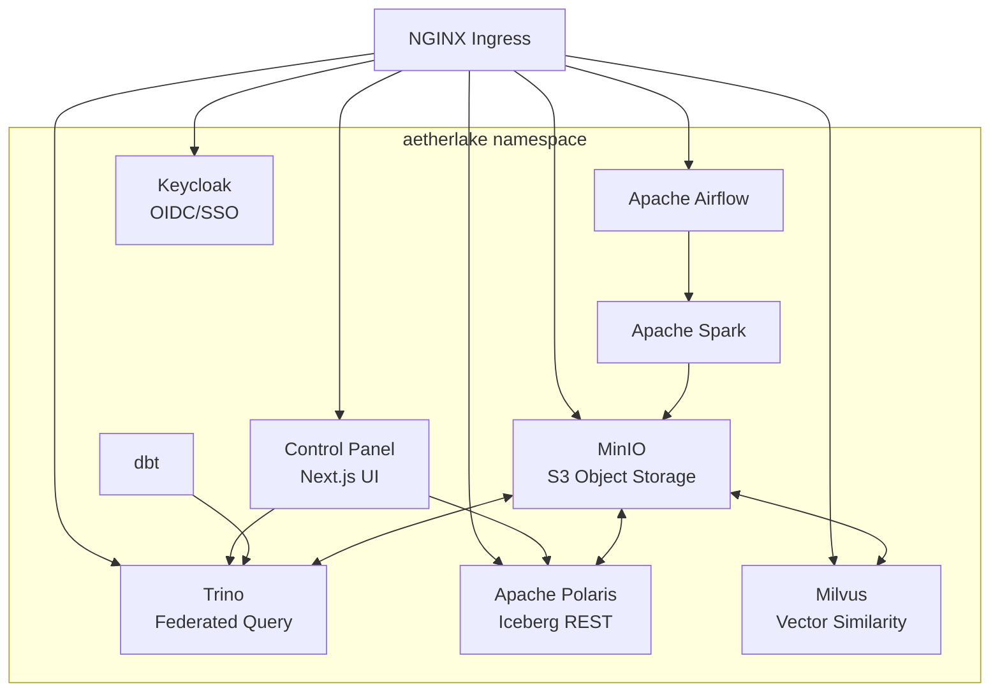

# Architecture

AetherLake relies on a decoupled, microservices-oriented architecture running entirely within Kubernetes.

## System Diagram

## How It Fits Together

1. **Storage Layer:** MinIO provides the foundational object storage tier, storing raw data, Iceberg tables, and AI vectors.
2. **Catalog Layer:** Apache Polaris tracks the metadata of all your data tables.
3. **Compute Layer:** Trino executes federated queries directly on Iceberg files, memory-optimized by its distributed nature. Spark is available for heavier batch processing.
4. **Security Layer:** Keycloak ensures that everything from the Trino JDBC endpoint to the Airflow web interface is secured via OAuth2/OIDC.
5. **Control Plane:** The custom Next.js Control Panel aggregates management functions, providing a single pane of glass over the entire stack.
