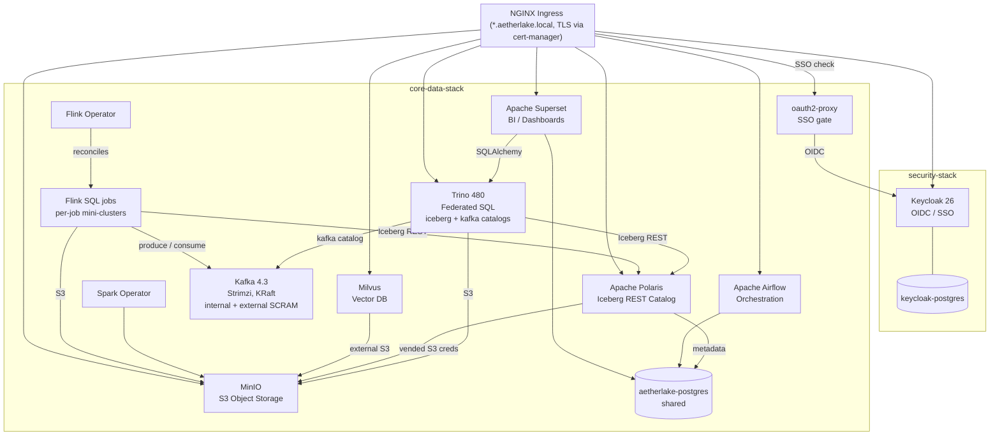
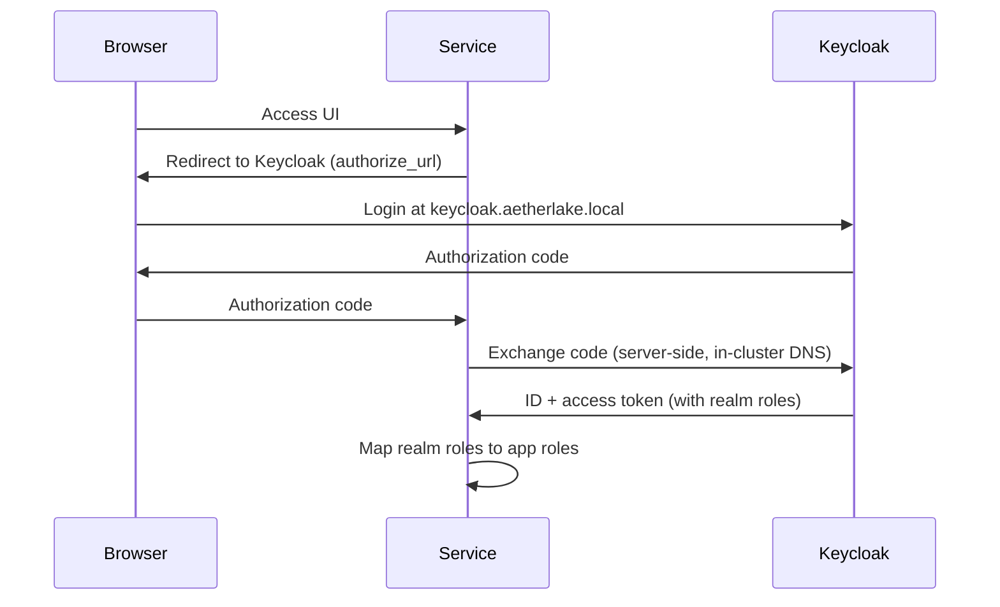
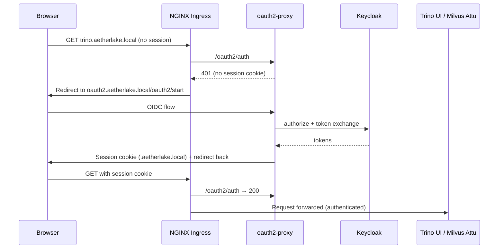
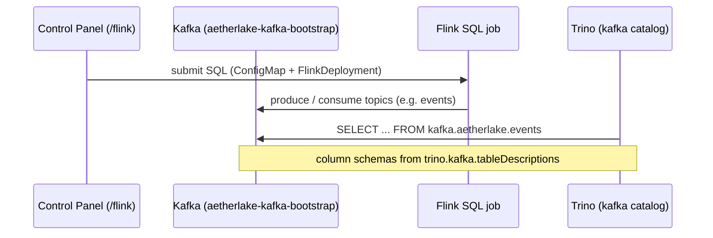
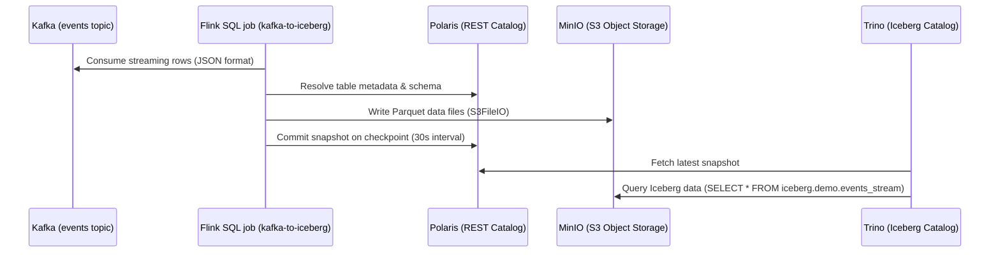
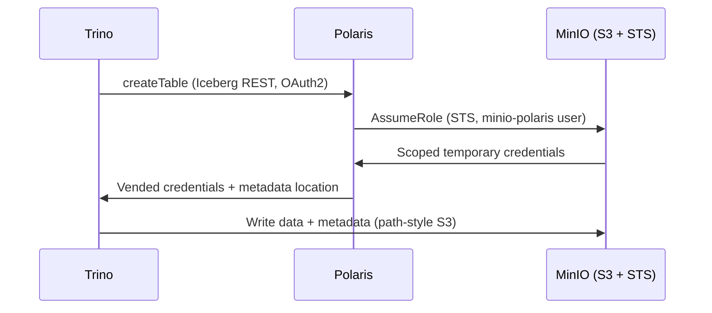

# Architecture

AetherLake is a decoupled, microservices-oriented data lakehouse running entirely
on Kubernetes. It is split into two Helm charts:

- **`security-stack`** — Keycloak (OIDC/SSO) + its PostgreSQL.
- **`core-data-stack`** — MinIO, Trino, Apache Polaris, Apache Spark, Apache
  Airflow, Apache Superset, Apache Kafka (Strimzi), Apache Flink (operator),
  the oauth2-proxy SSO gate, Milvus, and the shared PostgreSQL/Redis.

## System overview

```mermaid
graph TD
    subgraph ingress["NGINX Ingress (*.aetherlake.local, TLS via cert-manager)"]
    end

    subgraph sec["security-stack"]
        KC[Keycloak 26<br/>OIDC / SSO]
        KCPG[(keycloak-postgres)]
        KC --- KCPG
    end

    subgraph core["core-data-stack"]
        MinIO[MinIO<br/>S3 Object Storage]
        Trino[Trino 480<br/>Federated SQL<br/>iceberg + kafka catalogs]
        Polaris[Apache Polaris<br/>Iceberg REST Catalog]
        Spark[Spark Operator]
        Airflow[Apache Airflow<br/>Orchestration]
        Superset[Apache Superset<br/>BI / Dashboards]
        Kafka[Kafka 4.3<br/>Strimzi, KRaft<br/>internal + external SCRAM]
        FlinkOp[Flink Operator]
        FlinkJob[Flink SQL jobs<br/>per-job mini-clusters]
        Milvus[Milvus<br/>Vector DB]
        OA[oauth2-proxy<br/>SSO gate]
        PG[(aetherlake-postgres<br/>shared)]

        Trino -->|Iceberg REST| Polaris
        Polaris -->|metadata| PG
        Trino -->|S3| MinIO
        Polaris -->|vended S3 creds| MinIO
        Milvus -->|external S3| MinIO
        Airflow --> PG
        Superset --> PG
        Superset -->|SQLAlchemy| Trino
        Spark --> MinIO
        Trino -->|kafka catalog| Kafka
        FlinkOp -->|reconciles| FlinkJob
        FlinkJob -->|produce / consume| Kafka
        FlinkJob -->|Iceberg REST| Polaris
        FlinkJob -->|S3| MinIO
    end

    ingress -->|SSO check| OA
    OA -->|OIDC| KC
    ingress --> KC
    ingress --> MinIO
    ingress --> Trino
    ingress --> Polaris
    ingress --> Airflow
    ingress --> Superset
    ingress --> Milvus
```

## Layers

| Layer | Component(s) | Responsibility |
|-------|--------------|----------------|
| **Identity** | Keycloak + oauth2-proxy | Single sign-on, OIDC clients, realm roles; SSO gate for UIs without native OIDC |
| **Storage** | MinIO | S3-compatible object storage (Iceberg data, vectors, raw files) |
| **Catalog** | Apache Polaris | Iceberg REST catalog + S3 credential vending |
| **Query** | Trino | Federated SQL over the Iceberg catalog, Kafka topics, and other sources |
| **Streaming** | Apache Kafka (Strimzi) | Durable event streaming, in-cluster + authenticated external access |
| **Stream processing** | Apache Flink | SQL jobs that read/write Kafka topics (per-job mini-clusters) |
| **Processing** | Apache Spark | Distributed batch processing |
| **Orchestration** | Apache Airflow | DAG-based pipeline scheduling |
| **Analytics / BI** | Apache Superset | Dashboards and SQL exploration over Trino |
| **Vector search** | Milvus | Similarity search for AI/ML workloads |
| **Control** | Control Panel, MCP Server | Management UI + agent tooling |

## SSO / OIDC flow

Every service authenticates against the single `aetherlake` Keycloak realm. The
token issuer is `http://keycloak.aetherlake.local/realms/aetherlake`.

```mermaid
sequenceDiagram
    participant U as Browser
    participant S as Service
    participant KC as Keycloak
    U->>S: Access UI
    S->>U: Redirect to Keycloak (authorize_url)
    U->>KC: Login at keycloak.aetherlake.local
    KC->>U: Authorization code
    U->>S: Authorization code
    S->>KC: Exchange code (server-side, in-cluster DNS)
    KC->>S: ID + access token (with realm roles)
    S->>S: Map realm roles to app roles
```

::: warning In-cluster DNS
`keycloak.aetherlake.local` is an ingress host and does **not** resolve via
cluster DNS by default, so server-side OIDC discovery (MinIO, Superset, Airflow,
Polaris, oauth2-proxy) would fail. `install.sh` adds a CoreDNS rewrite mapping
that hostname to the Keycloak Service, keeping in-cluster discovery and browser
redirects consistent. See [Keycloak / SSO](./components/keycloak).
:::

### UIs without native OIDC: the oauth2-proxy gate

Some UIs have no Keycloak integration of their own — the **Trino web UI** and
**Milvus Attu**. They are protected by an
[oauth2-proxy](https://oauth2-proxy.github.io/oauth2-proxy/) deployment sitting
behind nginx external-auth annotations:

```mermaid
sequenceDiagram
    participant U as Browser
    participant N as NGINX Ingress
    participant OA as oauth2-proxy
    participant KC as Keycloak
    participant S as Trino UI / Milvus Attu
    U->>N: GET trino.aetherlake.local (no session)
    N->>OA: /oauth2/auth
    OA-->>N: 401 (no session cookie)
    N->>U: Redirect to oauth2.aetherlake.local/oauth2/start
    U->>OA: OIDC flow
    OA->>KC: authorize + token exchange
    KC-->>OA: tokens
    OA->>U: Session cookie (.aetherlake.local) + redirect back
    U->>N: GET with session cookie
    N->>OA: /oauth2/auth → 200
    N->>S: Request forwarded (authenticated)
```

One login covers every gated host: the session cookie is scoped to
`.aetherlake.local`. Trino runs the web UI with a fixed service user
(`web-ui.authentication.type=fixed`), since humans already passed the Keycloak
gate. The in-cluster Trino service (used by the Control Panel and MCP server)
is unaffected by the gate. See [Keycloak — SSO gate](./components/keycloak#sso-gate-oauth2-proxy).

## Streaming data path (Flink → Kafka → Trino)

```mermaid
sequenceDiagram
    participant CP as Control Panel (/flink)
    participant K as Kafka (aetherlake-kafka-bootstrap)
    participant F as Flink SQL job
    participant T as Trino (kafka catalog)
    CP->>F: submit SQL (ConfigMap + FlinkDeployment)
    F->>K: produce / consume topics (e.g. events)
    T->>K: SELECT ... FROM kafka.aetherlake.events
    Note over K,T: column schemas from trino.kafka.tableDescriptions
```

External producers/consumers connect through the `external` listener
(nodeport, TLS + SCRAM-SHA-512, `KafkaUser` credentials) — see
[Kafka — Producing from outside the cluster](./components/kafka#producing-from-outside-the-cluster).

## Streaming lakehouse bridge (Kafka → Flink → Iceberg → Trino)

```mermaid
sequenceDiagram
    participant K as Kafka (events topic)
    participant F as Flink SQL job (kafka-to-iceberg)
    participant P as Polaris (REST Catalog)
    participant M as MinIO (S3 Object Storage)
    participant T as Trino (Iceberg Catalog)
    F->>K: Consume streaming rows (JSON format)
    F->>P: Resolve table metadata & schema
    F->>M: Write Parquet data files (S3FileIO)
    F->>P: Commit snapshot on checkpoint (30s interval)
    T->>P: Fetch latest snapshot
    T->>M: Query Iceberg data (SELECT * FROM iceberg.demo.events_stream)
```

See [Data Pipelines — Kafka-to-Iceberg Bridge](./pipelines#kafka-iceberg-bridge).

## Lakehouse write path (Trino → Polaris → MinIO)

```mermaid
sequenceDiagram
    participant T as Trino
    participant P as Polaris
    participant M as MinIO (S3 + STS)
    T->>P: createTable (Iceberg REST, OAuth2)
    P->>M: AssumeRole (STS, minio-polaris user)
    M->>P: Scoped temporary credentials
    P->>T: Vended credentials + metadata location
    T->>M: Write data + metadata (path-style S3)
```

This **credential vending (subscoping)** path gives each query short-lived,
table-scoped S3 credentials instead of long-lived root keys. See
[Apache Polaris](./components/polaris).

## Next

- [Components overview](./components) — one-line summary + status of each service.
- [Kafka — Streaming](./components/kafka) and
  [Flink — Stream Processing](./components/flink) — the streaming layer in detail.
- Per-component reference pages with every setting live under **Component
  Reference** in the sidebar.
