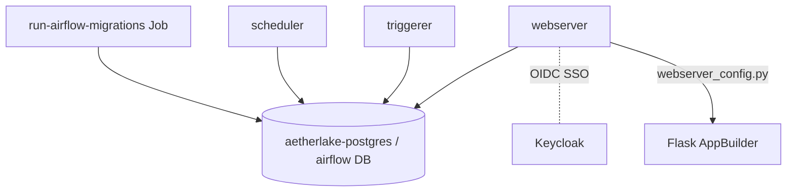

# Apache Airflow — Orchestration

Airflow schedules and runs data pipelines (DAGs). It runs the official Apache
chart with the `LocalExecutor` (no Celery/Redis), backed by the shared
PostgreSQL.

- **Chart:** `airflow` `1.16.0` (Apache) → `apache/airflow:2.10.5`
- **Executor:** `LocalExecutor`
- **Ingress:** `airflow.aetherlake.local` → `core-data-stack-webserver:8080`
- **Metadata DB:** `aetherlake-postgres` / database `airflow`

## Architecture



## Key settings (`core-data-stack/values.yaml` → `airflow`)

| Setting | Default | Description |
|---------|---------|-------------|
| `airflow.enabled` | `true` | Toggle orchestration |
| `airflow.executor` | `LocalExecutor` | No Celery workers/Redis |
| `airflow.defaultAirflowTag` | `2.10.5` | Image tag (last 2.x for FAB SSO) |
| `airflow.postgresql.enabled` | `false` | Use the shared postgres, not the bundled one |
| `airflow.redis.enabled` | `false` | Not needed with LocalExecutor |
| `airflow.workers.replicas` | `0` | No Celery workers |
| `airflow.data.metadataSecretName` | `airflow-official` | DB connection / fernet / secret key |
| `airflow.migrateDatabaseJob.useHelmHooks` | `false` | **Run migrations as a normal Job** |
| `airflow.createUserJob.useHelmHooks` | `false` | Run user creation as a normal Job |
| `airflow.webserver.webserverConfigConfigMapName` | `airflow-webserver-config` | OIDC `webserver_config.py` |

::: danger Migrations must not be Helm hooks
As post-install hooks, the Airflow migration shares the release hook chain with
the Superset init hook. If that fails/times out, Helm aborts the chain and the
Airflow migration **never runs** — scheduler/webserver hang forever in "Waiting
for migrations". `useHelmHooks: false` decouples them.
:::

## SSO (Keycloak OIDC)

The webserver uses a Flask AppBuilder `webserver_config.py` ConfigMap
(`templates/airflow-webserver-config.yaml`) wired to the `airflow` Keycloak
client. Realm roles map to Airflow roles: `data-admin → Admin`,
`data-engineer → Op`, `data-scientist → User`, others → `Public`.

| Env | Source |
|-----|--------|
| `AIRFLOW_OIDC_SECRET` | secret `airflow-oidc-secret` |
| `KEYCLOAK_BASE_URL` | `http://keycloak.aetherlake.local` |

## Operations

```bash
# Manually apply migrations (if ever needed)
CONN=$(kubectl get secret airflow-official -n aetherlake -o jsonpath='{.data.connection}' | base64 -d)
kubectl run airflow-migrate --rm -i --restart=Never -n aetherlake \
  --image=apache/airflow:2.10.5 \
  --env="AIRFLOW__DATABASE__SQL_ALCHEMY_CONN=$CONN" \
  --command -- airflow db migrate
```
