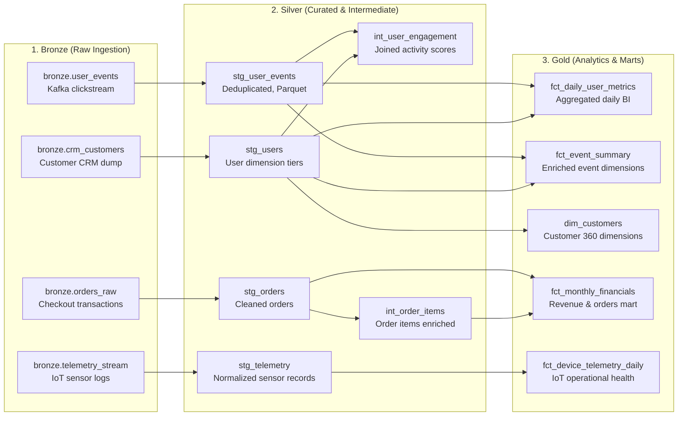

# dbt — Data Transformations & Modeling

dbt (data build tool) manages SQL-first data transformations in the AetherLake
Lakehouse using the Medallion Architecture (Bronze → Silver → Gold). Models run
on top of **Trino** over TLS (`dbt-trino`), writing Parquet files to MinIO S3 and
registering tables in the **Apache Polaris** Iceberg REST catalog.

- **Profile:** `pipelines/dbt/profiles.yml` (`lakehouse_trino`)
- **Adapter:** `dbt-trino` connecting via Trino HTTPS port `8443`
- **Catalog:** Apache Iceberg catalog managed by Polaris REST
- **Control Panel:** Interactive `/dbt` workspace (Lineage DAG, Model Inspector, Run Triggers, and Test Reports)

---

## 🏛️ Medallion Architecture Flow



---

## 🎛️ Control Panel Workspace

The `/dbt` page in the Control Panel provides an enterprise-grade web workspace:


1. **Scalable Interactive Data Lineage (DAG)**:
   - **Directional Flow & Connected Port Handles**: Visual bezier curves connecting source output handles to model input handles with closed directional arrows.
   - **Dynamic Lineage Tracing & Animated Pulses**: Selecting any node illuminates its upstream ancestors in glowing blue with animated directional particles flowing inward, and its downstream dependents in glowing emerald with outward-flowing particles. Unrelated nodes and edges are dimmed.
   - **Dagre Hierarchical Auto-Layout**: Automatically computes optimal ranks and positions from Left to Right (`LR`), scaling to dozens or hundreds of models without overlap.
   - **Interactive Canvas Controls**: Smooth mouse drag-pan, cursor-centered scroll zoom, **Fit to Screen**, **Interactive Radar MiniMap**, and **Fullscreen Mode** (`Escape` to exit).
   - **Focus Lineage Mode**: Instantly hides all unrelated graph elements to isolate only the connected ancestry tree of large models.
   - **Real-Time Search & Layer Filtering**: Filter nodes across All, Bronze, Silver, or Gold layers, or search dynamically by table name, schema, or description.
2. **Model Inspector & Dependencies**:
   - View raw Jinja/SQL source code and compiled Trino SQL in embedded Monaco editors.
   - Inspect column schemas, data types, descriptions, and applied data quality tests (`unique`, `not_null`, `accepted_values`).
   - Dedicated **Dependencies (Depends On)** tab listing clickable upstream parents and downstream children for instant canvas navigation.
3. **Execution & Test Runner**:
   - One-click triggers for `dbt run` and `dbt test` against Trino.
   - Real-time run logs and execution history with durations and model statuses.

---

## 🚀 Running dbt via CLI

To run dbt transformations locally from your terminal:

```bash
cd pipelines/dbt

# Test Trino TLS connection
dbt debug --profiles-dir .

# Run all models (Bronze -> Silver -> Gold)
dbt run --profiles-dir .

# Run data quality tests
dbt test --profiles-dir .

# Run only gold layer models
dbt run --select gold --profiles-dir .
```

### Connection Configuration (`profiles.yml`)

```yaml
lakehouse_trino:
  target: dev
  outputs:
    dev:
      type: trino
      method: ldap
      host: trino.aetherlake.local
      port: 8443
      user: admin
      password: "{{ env_var('TRINO_PASSWORD', 'admin123') }}"
      database: iceberg
      schema: lakehouse_silver
      threads: 4
      http_scheme: https
      cert: ../../control-panel/.ca/aetherlake-ca.crt
```

---

## 📁 Model Structure

| Layer | Path | Purpose | Materialization |
|:---|:---|:---|:---|
| **Sources** | `models/sources.yml` | Raw bronze table definitions | Source |
| **Silver** | `models/silver/stg_user_events.sql` | Cleaned and deduplicated events | `table` (Iceberg Parquet) |
| **Silver** | `models/silver/stg_users.sql` | User lifetime metrics & tiering | `table` (Iceberg Parquet) |
| **Gold** | `models/gold/fct_daily_user_metrics.sql` | Daily aggregated metrics for Superset | `table` (Iceberg Parquet) |
| **Gold** | `models/gold/fct_event_summary.sql` | Enriched event dimension mart | `table` (Iceberg Parquet) |
| **Tests** | `models/schema.yml` | Data quality validations | `unique`, `not_null`, `accepted_values` |

---

## 🔗 Related Components

- [Trino — Federated SQL](./trino) — executes dbt transformation queries
- [Apache Polaris — Iceberg Catalog](./polaris) — manages table metadata and snapshots
- [Apache Superset — BI & Dashboards](./superset) — visualizes gold layer marts
- [Control Panel](../control-panel) — web workspace for models and lineage
