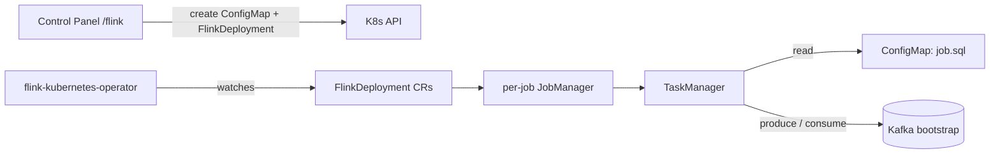

# Apache Flink — Stream Processing

Flink runs streaming SQL jobs on top of the platform: the Flink Kubernetes
Operator manages `FlinkDeployment` resources, and the Control Panel lets users
write Flink SQL (Monaco editor), submit it as a job, and track/cancel running
jobs. Every submitted job gets its own application-mode mini-cluster, so jobs
are isolated and cancellation is just a resource delete.

- **Chart:** `flink-kubernetes-operator` `1.15.0` from `downloads.apache.org/flink/...`
- **Operator image:** `apache/flink-kubernetes-operator:1.15.0` (Docker Hub)
- **Job runtime:** Flink `2.1` (`flinkVersion: v2_1`) via the SQL runner image
- **SQL runner image:** `aetherlake/flink-sql-runner:flink-2.1` — built by
  `install.sh` from `pipelines/flink/sql-runner` (the Apache
  `flink-sql-runner-example` on a `flink:2.1` base, with the Kafka SQL
  connector shaded into the fat jar)
- **Control Panel:** `/flink` page (submit / list / view SQL / cancel)
- **Ingress:** none — job dashboards are per-cluster and only reachable in-cluster

## Architecture



Each submission creates two resources: a ConfigMap `<name>-sql` holding the
script and a `FlinkDeployment` whose pod template mounts it at
`/opt/flink/sql/job.sql`. The runner image's entrypoint executes the script
statement by statement through `TableEnvironment#executeSql` (SET statements
and `EXECUTE STATEMENT SET` are supported).

## Key settings (`core-data-stack/values.yaml` → `flink`)

| Setting | Default | Description |
|---------|---------|-------------|
| `flink.enabled` | `true` | Toggle the operator dependency |
| `flink.sqlRunner.image` | `aetherlake/flink-sql-runner:flink-2.1` | Image used for SQL jobs (keep in sync with the Control Panel's `FLINK_SQL_RUNNER_IMAGE` env and `install.sh`) |
| `flink.jobs.flinkVersion` | `v2_1` | Flink runtime version recorded in docs/examples |
| `flink.jobs.jobManagerMemory` | `1024m` | Per-job JobManager memory |
| `flink.jobs.taskManagerMemory` | `2048m` | Per-job TaskManager memory |

## Submitting a SQL job

Use the Control Panel (**Apache Flink → Submit Job**) or apply a manifest
manually:

```yaml
apiVersion: flink.apache.org/v1beta1
kind: FlinkDeployment
metadata:
  name: my-kafka-etl
  namespace: aetherlake
spec:
  image: aetherlake/flink-sql-runner:flink-2.1
  imagePullPolicy: IfNotPresent
  flinkVersion: v2_1
  serviceAccount: flink
  flinkConfiguration:
    taskmanager.numberOfTaskSlots: "1"
  jobManager:
    resource: { memory: "1024m", cpu: 1 }
  taskManager:
    resource: { memory: "2048m", cpu: 1 }
  job:
    jarURI: local:///opt/flink/usrlib/sql-runner.jar
    args: ["/opt/flink/usrlib/sql-scripts/simple.sql"]
    parallelism: 1
    upgradeMode: stateless
```

Ready-made scripts live in `pipelines/flink/examples/` (datagen → Kafka,
Kafka → print).

::: tip
The operator's admission webhook needs cert-manager. `install.sh` provisions
cert-manager **before** the core data stack for exactly this reason; when
enabling `flink` on an existing release, also apply the CRDs from
`charts/flink-kubernetes-operator-*.tgz` (Helm only installs CRDs on fresh
installs).
:::

::: warning
Jobs run with `upgradeMode: stateless` — cancelling a job discards its state.
Point `state.savepoints.dir` at MinIO and switch to `last-state` upgrades if a
job needs savepoints.
:::

## Operations

```bash
# All Control Panel-managed SQL jobs carry this label
kubectl get flinkdeployments -n aetherlake -l aetherlake.io/flink-sql-job=true

# Job status
kubectl get flinkdeployment my-kafka-etl -n aetherlake \
  -o jsonpath='{.status.jobStatus.state}'

# JobManager logs
kubectl logs -n aetherlake -l app=my-kafka-etl,component=jobmanager

# Cancel a job (deletes its mini-cluster and, for Control Panel jobs, the SQL ConfigMap)
kubectl delete flinkdeployment my-kafka-etl -n aetherlake
```

## Related

- [Kafka — Streaming Platform](./kafka) — topics consumed/produced by Flink SQL
- [Control Panel](../control-panel) — the `/flink` UI
- [Data Pipelines](../pipelines) — example SQL under `pipelines/flink/examples`
