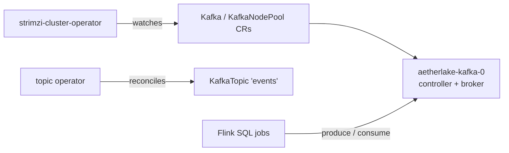

# Apache Kafka — Streaming Platform

Kafka provides the durable event-streaming layer: Flink SQL jobs consume and
produce topics, and future pipelines can bridge Kafka into the Iceberg
lakehouse. It is deployed by the Strimzi cluster operator in KRaft mode
(no ZooKeeper) as a single dual-role node, sized for local clusters.

- **Chart:** `strimzi-kafka-operator` `1.1.0` from `strimzi.io/charts/`
- **Kafka version:** 4.3.0 (KRaft, `KafkaNodePool` with controller + broker roles)
- **Cluster CR:** `templates/kafka-cluster.yaml` (`Kafka` + `KafkaNodePool` + `KafkaTopic`)
- **Bootstrap address (in-cluster):** `aetherlake-kafka-bootstrap:9092`
- **Ingress:** none — brokers are only reachable inside the cluster

## Architecture



## Key settings (`core-data-stack/values.yaml` → `kafka`)

| Setting | Default | Description |
|---------|---------|-------------|
| `kafka.enabled` | `true` | Toggle the Strimzi operator dependency and the Kafka cluster resources |
| `kafka.cluster.name` | `aetherlake` | `Kafka` CR name; brokers become `<name>-kafka-bootstrap` |
| `kafka.cluster.version` | `4.3.0` | Kafka version (must be supported by the pinned Strimzi operator) |
| `kafka.cluster.replicas` | `1` | Dual-role node count |
| `kafka.cluster.storageSize` | `10Gi` | Persistent log storage per node |
| `kafka.cluster.storageClassName` | `""` | Empty = cluster default StorageClass |
| `kafka.cluster.replicationFactor` | `1` | Topic/default replication; raise together with `replicas` |
| `kafka.external.enabled` | `true` | TLS + SCRAM-SHA-512 nodeport listener for clients outside the cluster |
| `kafka.external.username` | `external-producer` | `KafkaUser` holding the external credentials |
| `kafka.topics` | `events` | `KafkaTopic` resources reconciled by the topic operator |

::: warning
The internal `plain` listener has no authentication — it is cluster-internal
only and never exposed through any ingress. External access goes through the
`external` listener (TLS + SCRAM-SHA-512); see below. Strimzi ACLs are
cluster-wide, so they are intentionally not enabled (they would also lock down
the internal listeners) — the SCRAM identity is the external boundary.
:::

## Querying topics with Trino

Topics are exposed as Trino tables through the `kafka` connector catalog, so
data streamed by Flink SQL jobs is queryable with ordinary SQL:

```sql
SELECT * FROM kafka.aetherlake.events LIMIT 10;
```

Column schemas come from the JSON table descriptions in
`trino.kafka.tableDescriptions` (see [Trino](./trino#the-kafka-catalog)). Add a
description file whenever a new topic should be queryable.

## Control Panel

The Control Panel ships a Kafka view (`/kafka`, linked from the Overview
dashboard): cluster status and version, broker health, and the topic list with
partitions, replicas, config and reconciliation conditions — served through
`/api/kafka` against the Strimzi CRs, protected by the usual session auth.
The Flink SQL editor also lists topics and inserts a Kafka source-table
template on click.

## Producing from outside the cluster

The `external` listener (port 9094, `type: nodeport`, TLS, SCRAM-SHA-512)
accepts authenticated clients from outside; on Docker Desktop the bootstrap is
`localhost:<nodePort>`.

1. Gather connection material:

```bash
NODEPORT=$(kubectl get svc aetherlake-kafka-external-bootstrap -n aetherlake \
  -o jsonpath='{.spec.ports[0].nodePort}')
kubectl get secret aetherlake-cluster-ca-cert -n aetherlake \
  -o jsonpath='{.data.ca\.crt}' | base64 -d > cluster-ca.crt
kubectl get secret external-producer -n aetherlake \
  -o jsonpath='{.data.sasl\.jaas\.config}' | base64 -d   # sasl.jaas.config value
```

2. Build a truststore from the cluster CA (any JDK):

```bash
keytool -importcert -noprompt -alias ca -file cluster-ca.crt \
  -keystore client.p12 -storetype PKCS12 -storepass changeit
```

3. Client properties:

```properties
security.protocol=SASL_SSL
sasl.mechanism=SCRAM-SHA-512
sasl.jaas.config=<value from the external-producer secret>
ssl.truststore.location=client.p12
ssl.truststore.password=changeit
ssl.truststore.type=PKCS12
# The broker certificate does not carry the nodeport address; disable
# hostname verification for local testing.
ssl.endpoint.identification.algorithm=
```

4. Produce (any Kafka client; console example):

```bash
kafka-console-producer.sh --bootstrap-server localhost:$NODEPORT \
  --topic events --command-config producer.properties
```

Wrong credentials fail with `SaslAuthenticationException` — the listener
rejects anything that is not a valid `KafkaUser`.

## Operations

```bash
# Broker status (Strimzi adds the strimzi.io/kind label to node pods)
kubectl get pods -n aetherlake -l strimzi.io/cluster=aetherlake

# Kafka resource status as reported by the operator
kubectl get kafka aetherlake -n aetherlake -o jsonpath='{.status.conditions[*].type}'

# Create an extra topic
kubectl apply -n aetherlake -f - <<'EOF'
apiVersion: kafka.strimzi.io/v1
kind: KafkaTopic
metadata:
  name: my-topic
  labels:
    strimzi.io/cluster: aetherlake
spec:
  partitions: 3
  replicas: 1
EOF
```

## Related

- [Flink — Stream Processing](./flink) — submits SQL jobs that read/write Kafka topics
- [Trino — Federated SQL](./trino) — queries Kafka topics through the `kafka` catalog
- [Data Pipelines](../pipelines) — `pipelines/flink/examples` contains ready-to-submit SQL
