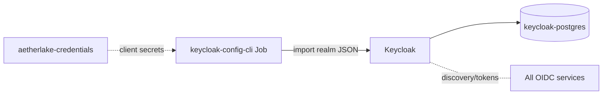

# Keycloak — Identity & SSO

Keycloak is the single OIDC/SSO provider for the whole platform. It ships in the
**`security-stack`** chart on upstream images (no Bitnami), alongside its own
dedicated PostgreSQL.

- **Image:** `quay.io/keycloak/keycloak:26.3.3`
- **Realm import tool:** `adorsys/keycloak-config-cli:6.5.1-26`
- **Realm:** `aetherlake`
- **Issuer:** `http://keycloak.aetherlake.local/realms/aetherlake`
- **Ingress:** `keycloak.aetherlake.local` → `security-stack-keycloak:80`

## Architecture



The realm (`helm-charts/security-stack/files/aetherlake-realm.json`) is imported
by a `keycloak-config-cli` Job after Keycloak starts.

## Realm clients

| Client ID | Used by | Secret key (in `aetherlake-credentials`) |
|-----------|---------|------------------------------------------|
| `aetherlake-client` | Control Panel | `control-panel-oidc-secret` |
| `trino` | Trino | `trino-oidc-secret` |
| `airflow` | Airflow web UI | `airflow-oidc-secret` |
| `polaris` | Polaris | `polaris-oidc-secret` |
| `minio` | MinIO console | `minio-oidc-secret` |
| `superset` | Superset | `superset-oidc-secret` |

### Realm roles → app roles

| Realm role | Airflow | Superset | MinIO policy |
|------------|---------|----------|--------------|
| `data-admin` | `Admin` | `Admin` | `consoleAdmin` |
| `data-engineer` | `Op` | `Alpha` | — |
| `data-scientist` | `User` | `Alpha` | — |
| *(others)* | `Public` | `Gamma` | — |

## Key settings (`security-stack/values.yaml`)

| Setting | Default | Description |
|---------|---------|-------------|
| `keycloak.image` | `quay.io/keycloak/keycloak:26.3.3` | Server image |
| `keycloak.auth.adminUser` | `admin` | Admin console user |
| `keycloak.auth.passwordSecretKey` | `keycloak-admin-password` | Admin password key in the secret |
| `keycloak.postgres.passwordSecretKey` | `keycloak-db-password` | DB password key — separate from the shared `postgres-password` ([why](./postgres#why-keycloak-keeps-its-own-database)) |
| `keycloak.extraEnvVars[KC_HOSTNAME]` | `keycloak.aetherlake.local` | Public hostname |
| `keycloak.extraEnvVars[KC_HOSTNAME_STRICT]` | `false` | Allow non-strict hostname |
| `keycloak.extraEnvVars[KC_PROXY_HEADERS]` | `xforwarded` | Behind the ingress |
| `keycloakConfigCli.enabled` | `true` | Run the realm import Job |

## The two SSO gotchas (already fixed in this chart)

::: danger keycloak-config-cli variable substitution
The realm references client secrets as **`$(env:VAR)`** — not `${ENV:VAR}` —
because config-cli deliberately uses `$(...)` to avoid clashing with Keycloak's
own `${...}` placeholders, **and** substitution is **disabled by default**.
Both are required: `IMPORT_VARSUBSTITUTION_ENABLED=true` is set in
`keycloakConfigCli.extraEnvVars`, and every confidential client carries an
explicit `"secret": "$(env:...)"`. Without this, OIDC handshakes fail with a
literal/auto-generated secret.
:::

::: warning In-cluster DNS
`install.sh` adds a CoreDNS rewrite so `keycloak.aetherlake.local` resolves to
the Keycloak Service inside the cluster. Otherwise MinIO blocks its entire IAM
subsystem ("Waiting for OpenID to be initialized") and all server-side OIDC
discovery times out.
:::

## Operations

```bash
# Admin password
kubectl get secret aetherlake-credentials -n aetherlake \
  -o jsonpath='{.data.keycloak-admin-password}' | base64 -d

# Verify a client secret matches (client_credentials → expect HTTP 200)
SECRET=$(kubectl get secret aetherlake-credentials -n aetherlake \
  -o jsonpath='{.data.minio-oidc-secret}' | base64 -d)
curl -s -o /dev/null -w '%{http_code}\n' \
  -X POST http://security-stack-keycloak/realms/aetherlake/protocol/openid-connect/token \
  -d grant_type=client_credentials -d client_id=minio -d client_secret="$SECRET"
```
