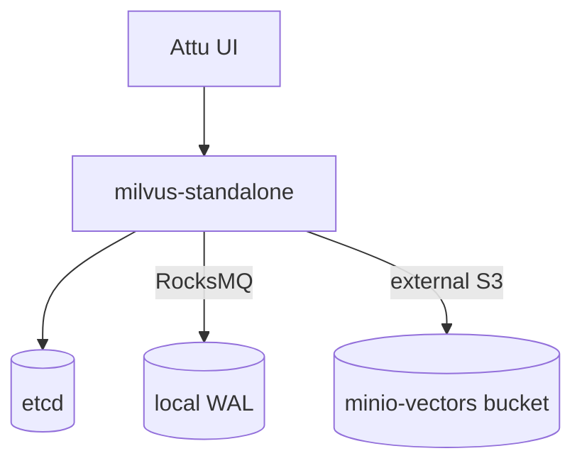

# Milvus — Vector Database

Milvus provides similarity search for AI/ML workloads (embeddings). It runs in
**standalone** mode with **RocksMQ** as the message queue and uses MinIO as its
external object store. **Attu** is the web UI.

- **Chart:** `milvus` `5.0.14` from `zilliztech.github.io/milvus-helm`
- **Mode:** standalone (cluster disabled to save resources)
- **Ingress (Attu UI):** `milvus.aetherlake.local` → `core-data-stack-milvus-attu:3000`
- **gRPC:** `core-data-stack-milvus:19530`

## Architecture



## Key settings (`core-data-stack/values.yaml` → `milvus`)

| Setting | Default | Description |
|---------|---------|-------------|
| `milvus.enabled` | `true` | Toggle vector DB |
| `milvus.cluster.enabled` | `false` | Standalone for dev (saves resources) |
| `milvus.standalone.enabled` | `true` | Single-node mode |
| `milvus.standalone.messageQueue` | `rocksmq` | Embedded MQ (no Pulsar/Kafka) |
| `milvus.pulsarv3.enabled` / `milvus.pulsar.enabled` | `false` | Disabled (RocksMQ instead) |
| `milvus.attu.enabled` | `true` | Web UI |
| `milvus.minio.enabled` | `false` | Use the platform MinIO, not a bundled one |
| `milvus.externalS3.host` | `minio-hl` | Platform MinIO service |
| `milvus.externalS3.bucketName` | `milvus-vectors` | Vector segment bucket |
| `milvus.externalS3.accessKey` / `secretKey` | `${ENV:MINIO_ACCESS_KEY/SECRET_KEY}` | From the credentials secret |

## ⚠️ Known issue — standalone crash-loops on Milvus 2.6.11

The chart (`milvus-helm` 5.0.14) ships **Milvus 2.6.11**, where the **streaming
node** is a mandatory component. On startup its chunk manager fails:

```
StreamingNode init failed: StreamingNode try to new chunk manager failed:
Endpoint url cannot have fully qualified paths. (minio.ErrorResponse)
```

The proxy then loops on *"find no available mixcoord, check mixcoord state"* and
the pod crash-loops. This blocks Milvus only — the rest of the stack is healthy.

### What was investigated (none resolved it)

| Attempt | Result |
|---------|--------|
| `woodpecker.storage.type: local` (move streaming WAL off S3) | No change — the streaming node uses the global `minio` config, not `woodpecker.storage` |
| `cloudProvider: minio` + real root creds + `useVirtualHost: false` | No change |
| Inject `MINIO_ACCESS_KEY/SECRET_KEY` env (they are unset on the pod) | Endpoint error happens before credentials matter |
| Pin image to `milvusdb/milvus:v2.5.4` (no mandatory streaming node) | The streaming-node error disappears, but a 2.5 image against the chart's 2.6-oriented config mismatches and crashes differently |

The global `minio` config is well-formed (`address: minio-hl`, `port: 9000`,
`useVirtualHost: false`), and every other Milvus component uses it successfully —
only the 2.6 streaming node mishandles the endpoint. This is an **upstream
Milvus 2.6.11 / milvus-helm 5.0.14 incompatibility**, not a config error fixable
from this chart.

### Path forward (future work)

1. **Recommended:** downgrade `milvus-helm` to a version that natively ships a
   stable standalone **2.5.x** (matched chart + image + config, no mandatory
   streaming node) — a deliberate `Chart.yaml` dependency change.
2. Or adopt a later **2.6.x** patch once the streaming-node chunk-manager bug is
   fixed upstream and re-validate against this MinIO setup.

Until then Milvus is left at the chart default (2.6.11) and is the one component
not yet operational; the lakehouse core (SSO, MinIO, Polaris, Trino, Airflow,
Superset) is fully working.

## Operations

```bash
# Attu UI
open http://milvus.aetherlake.local

# Standalone logs
kubectl logs -n aetherlake -l app.kubernetes.io/name=milvus,component=standalone --tail=50
```
