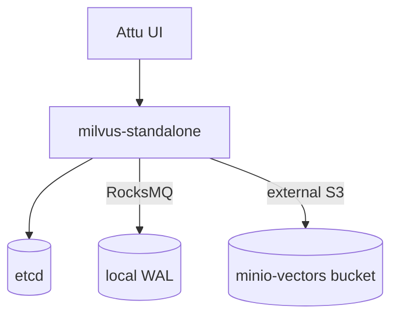

# Milvus — Vector Database

Milvus provides similarity search for AI/ML workloads (embeddings). It runs in
**standalone** mode with **RocksMQ** as the message queue and uses MinIO as its
external object store. **Attu** is the web UI.

- **Chart:** `milvus` `5.0.14` from `zilliztech.github.io/milvus-helm`
- **Mode:** standalone (cluster disabled to save resources)
- **Ingress (Attu UI):** `milvus.aetherlake.local` → `core-data-stack-milvus-attu:3000`
- **gRPC:** `core-data-stack-milvus:19530`

## Architecture



## Key settings (`core-data-stack/values.yaml` → `milvus`)

| Setting | Default | Description |
|---------|---------|-------------|
| `milvus.enabled` | `true` | Toggle vector DB |
| `milvus.cluster.enabled` | `false` | Standalone for dev (saves resources) |
| `milvus.standalone.enabled` | `true` | Single-node mode |
| `milvus.standalone.messageQueue` | `rocksmq` | Embedded MQ (no Pulsar/Kafka) |
| `milvus.pulsarv3.enabled` / `milvus.pulsar.enabled` | `false` | Disabled (RocksMQ instead) |
| `milvus.attu.enabled` | `true` | Web UI |
| `milvus.minio.enabled` | `false` | Use the platform MinIO, not a bundled one |
| `milvus.externalS3.host` | `minio-hl` | Platform MinIO service |
| `milvus.externalS3.bucketName` | `milvus-vectors` | Vector segment bucket |
| `milvus.externalS3.accessKey` / `secretKey` | `${ENV:MINIO_ACCESS_KEY/SECRET_KEY}` | From the credentials secret |

## Gotcha — Kubernetes service-link env collision (fixed)

On Milvus 2.6.11 the mandatory **streaming node** initially crash-looped:

```
StreamingNode init failed: StreamingNode try to new chunk manager failed:
Endpoint url cannot have fully qualified paths. (minio.ErrorResponse)
```

**Root cause:** the MinIO tenant exposes a Service named `minio`, so Kubernetes
auto-injects *service-link* environment variables into every pod in the
namespace — including:

```
MINIO_PORT=tcp://10.x.x.x:80
```

Milvus reads `MINIO_PORT` as the override for `minio.port`, so the S3 endpoint
became `minio-hl:tcp://10.x.x.x:80` → a "fully qualified path" the MinIO Go SDK
rejects. (The config file itself was fine — `address: minio-hl`, `port: 9000`.)

**Fix (in this chart):** set the MinIO connection explicitly via
`milvus.standalone.extraEnv` so the pod-spec env wins over the auto-injected
service links, and provide credentials through Milvus's native env override:

```yaml
milvus:
  standalone:
    extraEnv:
      - name: MINIO_ADDRESS
        value: "minio-hl"
      - name: MINIO_PORT
        value: "9000"
      - name: MINIO_ACCESSKEYID
        valueFrom: { secretKeyRef: { name: open-lake-credentials, key: minio-root-user } }
      - name: MINIO_SECRETACCESSKEY
        valueFrom: { secretKeyRef: { name: open-lake-credentials, key: minio-root-password } }
```

The `externalS3.accessKey/secretKey: "${ENV:...}"` placeholders do **not** resolve
(Milvus has no such substitution) and are superseded by the env override above.
Verified live: standalone comes up `1/1`, `/healthz` returns `OK`.

> If you hit *"IAM sub-system not initialized"* or service-link collisions for
> other components, the same root cause applies — a Service whose name matches a
> config env-override prefix. Set the value explicitly via `extraEnv`.

## Operations

```bash
# Attu UI
open http://milvus.aetherlake.local

# Standalone logs
kubectl logs -n aetherlake -l app.kubernetes.io/name=milvus,component=standalone --tail=50
```
