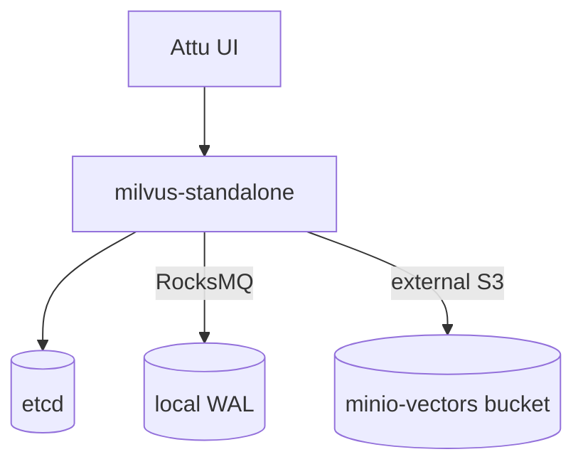

# Milvus — Vector Database

Milvus provides similarity search for AI/ML workloads (embeddings). It runs in
**standalone** mode with **RocksMQ** as the message queue and uses MinIO as its
external object store. **Attu** is the web UI.

- **Chart:** `milvus` `5.0.14` from `zilliztech.github.io/milvus-helm`
- **Mode:** standalone (cluster disabled to save resources)
- **Ingress (Attu UI):** `milvus.aetherlake.local` → `core-data-stack-milvus-attu:3000`
- **gRPC:** `core-data-stack-milvus:19530`

## Architecture



## Key settings (`core-data-stack/values.yaml` → `milvus`)

| Setting | Default | Description |
|---------|---------|-------------|
| `milvus.enabled` | `true` | Toggle vector DB |
| `milvus.cluster.enabled` | `false` | Standalone for dev (saves resources) |
| `milvus.standalone.enabled` | `true` | Single-node mode |
| `milvus.standalone.messageQueue` | `rocksmq` | Embedded MQ (no Pulsar/Kafka) |
| `milvus.pulsarv3.enabled` / `milvus.pulsar.enabled` | `false` | Disabled (RocksMQ instead) |
| `milvus.attu.enabled` | `true` | Web UI |
| `milvus.minio.enabled` | `false` | Use the platform MinIO, not a bundled one |
| `milvus.externalS3.host` | `minio-hl` | Platform MinIO service |
| `milvus.externalS3.bucketName` | `milvus-vectors` | Vector segment bucket |
| `milvus.externalS3.accessKey` / `secretKey` | `${ENV:MINIO_ACCESS_KEY/SECRET_KEY}` | From the credentials secret |

::: warning Known issue — standalone startup
On resource-constrained single-node clusters (e.g. docker-desktop), the
standalone pod can crash-loop with *"find no available mixcoord, check mixcoord
state"* while the embedded coordinator initializes. This is an active
investigation item (RocksMQ standalone startup), tracked separately from the rest
of the stack which is healthy.
:::

## Operations

```bash
# Attu UI
open http://milvus.aetherlake.local

# Standalone logs
kubectl logs -n aetherlake -l app.kubernetes.io/name=milvus,component=standalone --tail=50
```
