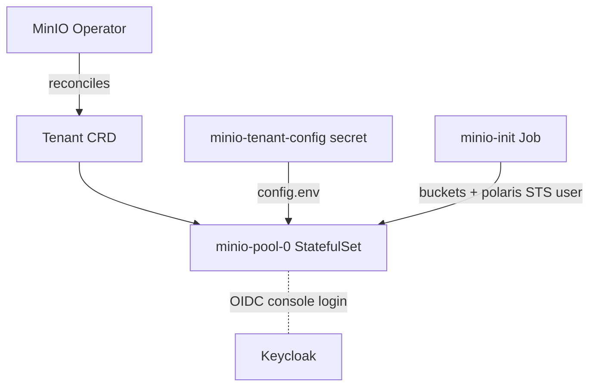

# MinIO — Object Storage

MinIO is the S3-compatible storage tier: it holds Iceberg table data/metadata,
Milvus vectors, and raw files. It is deployed as a **MinIO Operator `Tenant`**
(CRD), not a plain Deployment.

- **Image:** `quay.io/minio/minio:RELEASE.2025-04-08T15-41-24Z`
- **Operator:** installed by `install.sh` if the `tenants.minio.min.io` CRD is missing
- **Ingress (console):** `minio.aetherlake.local` → `minio-console:9090`
- **In-cluster S3 endpoint:** `http://minio-hl:9000`

## Architecture



::: danger The MinIO Operator is a prerequisite
The `Tenant` CRD is only reconciled if the MinIO Operator is running. Without it
there is **no storage** and the whole lakehouse fails. `install.sh` installs it
automatically when the CRD is absent.
:::

## Buckets

| Bucket | Purpose |
|--------|---------|
| `lakehouse` | Iceberg tables (via Polaris) |
| `milvus-vectors` | Milvus vector segments |

Created by the `minio-init` Job, which also provisions the `polaris` S3 user used
for credential vending (see [Polaris](./polaris)).

## Key settings (`core-data-stack/values.yaml` → `minio`)

| Setting | Default | Description |
|---------|---------|-------------|
| `minio.enabled` | `true` | Toggle storage |
| `minio.servers` | `1` | Tenant server count (standalone for dev) |
| `minio.volumesPerServer` | `1` | Drives per server |
| `minio.storageSize` | `20Gi` | Per-drive size |
| `minio.storageClassName` | `hostpath` | StorageClass (docker-desktop default) |
| `minio.rootUser` | *(install.sh `--set`)* | Root access key; randomized at install |
| `minio.rootPassword` | *(install.sh `--set`)* | Root secret key; randomized at install |
| `minio.initBuckets` | `[lakehouse, milvus-vectors]` | Buckets to create |
| `minio.oidc.configUrl` | `…/realms/aetherlake/.well-known/openid-configuration` | OIDC discovery |
| `minio.oidc.clientId` | `minio` | Keycloak client |
| `minio.oidc.clientSecret` | *(install.sh `--set`)* | Matches the `minio` Keycloak client |

::: tip Credentials are randomized
`install.sh` generates the root credentials and passes them with `--set` so the
tenant config matches the `minio-root-user`/`minio-root-password` keys in
`aetherlake-credentials` that Trino, Milvus and Polaris read. Never rely on the
`CHANGE_ME` placeholders in `values.yaml`.
:::

## STS / credential vending

MinIO's STS `AssumeRole` powers Polaris credential vending. The **root account
cannot AssumeRole**, so the `minio-init` Job creates a dedicated `polaris` user
with a bucket-scoped policy (`polaris-rw`). See [Polaris](./polaris) for the full
vending path.

## Operations

```bash
# Root credentials
kubectl get secret aetherlake-credentials -n aetherlake -o jsonpath='{.data.minio-root-user}' | base64 -d
kubectl get secret aetherlake-credentials -n aetherlake -o jsonpath='{.data.minio-root-password}' | base64 -d

# List buckets from inside the tenant pod
RU=$(kubectl get secret aetherlake-credentials -n aetherlake -o jsonpath='{.data.minio-root-user}' | base64 -d)
RP=$(kubectl get secret aetherlake-credentials -n aetherlake -o jsonpath='{.data.minio-root-password}' | base64 -d)
kubectl exec -n aetherlake minio-pool-0-0 -c minio -- sh -c "mc alias set m http://localhost:9000 $RU $RP && mc ls m"
```

::: warning IAM stuck "not initialized"
If `mc admin` calls return *"IAM sub-system not initialized"*, MinIO cannot reach
Keycloak for OIDC discovery — verify the CoreDNS rewrite for
`keycloak.aetherlake.local` exists (see [Keycloak](./keycloak)).
:::
