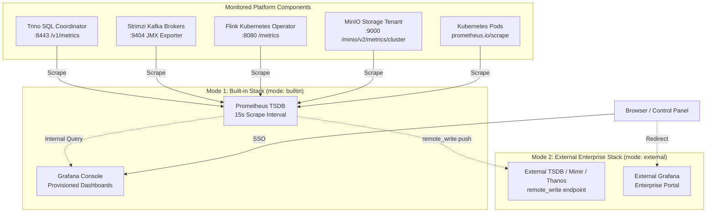

# Prometheus & Grafana — Observability Stack

The AetherLake Observability Stack combines **Prometheus** (time-series metrics engine) and **Grafana** (unified analytics dashboards) to provide comprehensive operational visibility across the entire data lakehouse.

AetherLake supports **Dual-Mode Observability**:
1. **Built-in Mode (`mode: "builtin"`)**: Deploys an in-cluster Prometheus TSDB and Grafana server with automated dashboard provisioning and Keycloak SSO integration.
2. **External Mode (`mode: "external"`)**: Connects to an existing enterprise observability stack (Grafana Cloud, Mimir, Thanos, VictoriaMetrics, Cortex) with optional `remote_write` metric forwarding.

- **Prometheus version:** 2.51.0 (lightweight TSDB, automated Kubernetes service discovery, optional `remote_write` agent)
- **Grafana version:** 10.4.1 (pre-configured datasources and automated dashboard provisioning)
- **Manifest:** `helm-charts/core-data-stack/templates/monitoring.yaml`
- **Default In-Cluster Ingress:**
  - Prometheus: `http://prometheus.aetherlake.local` (SSO gated) or `aetherlake-prometheus:9090` (in-cluster)
  - Grafana: `http://grafana.aetherlake.local` (SSO gated) or `aetherlake-grafana:3000` (in-cluster)

---

## 🏛️ Architecture & Dual-Mode Deployment



---

## 🚀 Deployment Modes

### Mode 1: Built-in In-Cluster Stack (Default)

In this mode, AetherLake automatically deploys both Prometheus and Grafana directly inside the `aetherlake` namespace:
- **Prometheus** scrapes all cluster components every 15 seconds and retains data for 15 days on local storage.
- **Grafana** provisions pre-configured dashboards for Trino, Kafka, Flink, and MinIO, wired directly to the in-cluster Prometheus datasource.
- Both services are exposed via NGINX Ingress with **Keycloak SSO** authentication.

```yaml
# helm-charts/core-data-stack/values.yaml
monitoring:
  enabled: true
  mode: "builtin"
  builtin:
    prometheus:
      image: "prom/prometheus:v2.51.0"
      retention: "15d"
    grafana:
      image: "grafana/grafana:10.4.1"
```

### Mode 2: External Monitoring & TSDB Ingestion

If your organization already maintains an enterprise observability system (such as Grafana Cloud, Datadog, Prometheus/Mimir, Thanos, or Cortex), you can configure AetherLake in external mode:
1. **Disable In-Cluster Grafana**: Prevents redundant pod resources while pointing users and the Control Panel to your external URL.
2. **Dynamic Ingress / UI Links**: Links in the Control Panel (Sidebar, Observability view, and Home Service cards) automatically point to your external Grafana address.
3. **Automated Metric Forwarding (`remote_write`)**: When `remoteWriteUrl` is specified, in-cluster Prometheus runs in scrape-and-forward mode to ship all Lakehouse metrics directly into your external TSDB.

```yaml
# helm-charts/core-data-stack/values.yaml
monitoring:
  enabled: true
  mode: "external"
  external:
    # External Grafana instance accessible by your team
    grafanaUrl: "https://grafana.corp.example.com"
    # External Prometheus query endpoint
    prometheusUrl: "https://prometheus.corp.example.com"
    # Remote write endpoint (e.g. Mimir, Thanos Receive, Grafana Cloud)
    remoteWriteUrl: "https://mimir.corp.example.com/api/v1/push"
    # Optional Basic Auth credentials
    remoteWriteAuth:
      username: "aetherlake-agent"
      passwordSecret: "aetherlake-credentials"
      passwordKey: "mimir-api-key"
```

::: tip Resource Optimization
If `remoteWriteUrl` is omitted in `external` mode, neither Prometheus nor Grafana pods will be deployed in the cluster, completely freeing cluster memory and CPU resources.
:::

---

## 📊 Pre-Configured Lakehouse Dashboards

When running in built-in mode (or importing into external Grafana), the following dashboards are pre-configured in `aetherlake-grafana-dashboards`:

1. **Platform Health & Status**: Live count of active services and healthy Kubernetes pods.
2. **Trino SQL Performance**: Query execution throughput, running stage threads, and process memory.
3. **Kafka Stream Metrics**: Ingestion/consumption rates, topic partition distribution, and consumer lag.
4. **Flink Processing**: Active streaming jobs, checkpoint durations, and operator state.
5. **MinIO Object Storage**: Cluster storage consumption, S3 API operations (GET/PUT), and error rates.

---

## 🖥️ Control Panel Integration

The AetherLake Control Panel dynamically respects the monitoring configuration:
- **Sidebar & Overview**: The Grafana link dynamically navigates to `process.env.NEXT_PUBLIC_GRAFANA_URL` (falling back to `http://grafana.aetherlake.local`).
- **Observability Hub**: The Pod logs, Kubernetes events, and resource metrics view embeds or deep-links to the target Grafana instance.
- **Service Catalog**: The home services grid displays Grafana with live health checks and endpoint details.

To configure an external Grafana URL in the Control Panel, set the environment variable in your deployment:
```bash
NEXT_PUBLIC_GRAFANA_URL="https://grafana.corp.example.com"
```

---

## 🔐 Access & Single Sign-On

Both in-cluster Prometheus and Grafana are routed via NGINX Ingress and protected by **Keycloak SSO** via `oauth2-proxy`:

| Service | Hostname | Default Credentials / Auth |
|---------|----------|----------------------------|
| Grafana | `http://grafana.aetherlake.local` | Keycloak SSO or admin credentials from `aetherlake-credentials` (`grafana-admin-password`) |
| Prometheus | `http://prometheus.aetherlake.local` | Keycloak SSO gate |

Add the DNS hosts to `/etc/hosts` for local development:
```
127.0.0.1  grafana.aetherlake.local prometheus.aetherlake.local
```

---

## ⚙️ Configuration Reference (`monitoring` block)

| Setting | Default | Description |
|---------|---------|-------------|
| `monitoring.enabled` | `true` | Enables or disables the monitoring subsystem |
| `monitoring.mode` | `"builtin"` | Deployment mode: `"builtin"` (in-cluster) or `"external"` (remote) |
| `monitoring.builtin.prometheus.image` | `prom/prometheus:v2.51.0` | Container image for in-cluster Prometheus |
| `monitoring.builtin.prometheus.retention` | `15d` | TSDB retention window |
| `monitoring.builtin.prometheus.resources` | `100m / 256Mi` (req) | CPU/Memory allocations for Prometheus |
| `monitoring.builtin.grafana.image` | `grafana/grafana:10.4.1` | Container image for in-cluster Grafana |
| `monitoring.builtin.grafana.resources` | `100m / 256Mi` (req) | CPU/Memory allocations for Grafana |
| `monitoring.external.grafanaUrl` | `""` | URL of external Grafana instance |
| `monitoring.external.prometheusUrl` | `""` | URL of external Prometheus instance |
| `monitoring.external.remoteWriteUrl` | `""` | Remote write URL for streaming metrics to external TSDB |
| `monitoring.external.remoteWriteAuth.username` | `""` | Optional HTTP Basic Auth username for remote write |
| `monitoring.external.remoteWriteAuth.passwordSecret` | `""` | Secret name holding remote write auth password |
| `monitoring.external.remoteWriteAuth.passwordKey` | `""` | Secret key containing remote write auth password |
