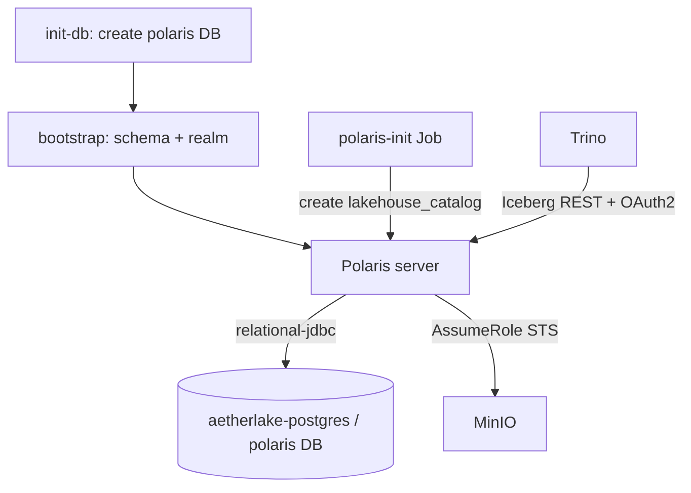
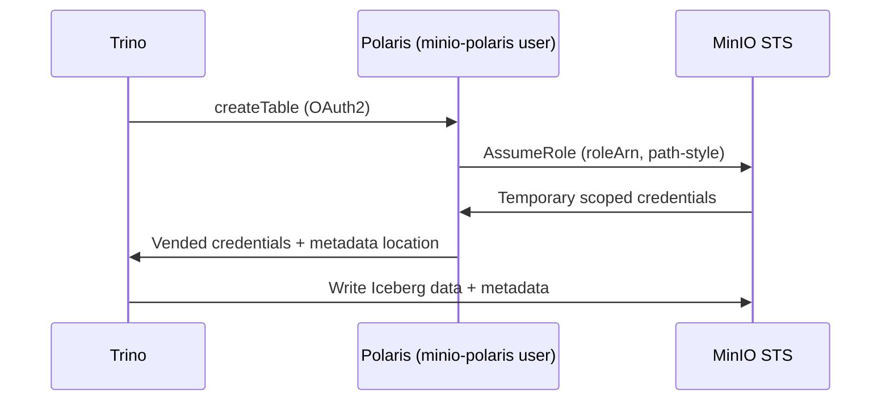

# Apache Polaris — Iceberg REST Catalog

Polaris is the Iceberg REST catalog: it tracks table metadata and vends
short-lived, scoped S3 credentials to query engines. It is a local subchart
(`helm-charts/core-data-stack/charts/polaris`) running `apache/polaris:latest`.

- **Ingress:** `polaris.aetherlake.local` → `core-data-stack-polaris:8181`
- **Catalog:** `lakehouse_catalog` (base location `s3://lakehouse/`)
- **Realm:** `POLARIS` (Polaris-internal, distinct from the Keycloak realm)

## Architecture



## Persistence (PostgreSQL metastore)

Polaris defaults to an **in-memory** metastore that loses all catalogs on
restart. AetherLake uses a **`relational-jdbc`** metastore on the shared
`aetherlake-postgres` (database `polaris`). Two init-containers make this
idempotent across restarts:

1. **`init-db`** (postgres image): waits for postgres, creates the `polaris`
   database if missing, and flags whether the `polaris_schema` schema needs
   bootstrapping.
2. **`bootstrap`** (admin-tool image): runs `polaris-admin-tool bootstrap` only
   when the schema is empty (re-running bootstrap on an initialized DB errors).

### Persistence settings (`polaris/values.yaml` → `persistence`)

| Setting | Default | Description |
|---------|---------|-------------|
| `persistence.postgres.host` | `aetherlake-postgres` | Shared postgres service |
| `persistence.postgres.port` | `5432` | Port |
| `persistence.postgres.database` | `polaris` | Metastore DB |
| `persistence.postgres.username` | `postgres` | DB user |
| `persistence.postgres.passwordSecret` | `open-lake-credentials` | Secret name |
| `persistence.postgres.passwordSecretKey` | `postgres-password` | Secret key |
| `adminImage.repository` | `apache/polaris-admin-tool` | Bootstrap tool image |

## Credential vending (subscoping)

When a query creates/loads a table, Polaris calls **MinIO STS `AssumeRole`** to
mint short-lived, table-prefix-scoped S3 credentials and vends them to Trino.
This avoids handing long-lived root keys to query engines.



### What makes vending work (all configured in the chart)

| Requirement | Where | Why |
|-------------|-------|-----|
| Non-root MinIO user `polaris` + `polaris-rw` policy | `minio-init` Job | Root cannot AssumeRole |
| `AWS_ACCESS_KEY_ID/SECRET` = `minio-polaris` user | Polaris deployment env | STS auth identity |
| `AWS_ENDPOINT_URL_STS=http://minio-hl:9000` | Polaris deployment env | Else AssumeRole hits real AWS (STS 403) |
| Catalog `storageConfigInfo` **top-level** `endpoint` / `stsEndpoint` / `pathStyleAccess` | `polaris-init` Job | Nested `properties.s3.*` keys are ignored; without path-style the S3 client tries `bucket.minio-hl` (UnknownHost) |
| `roleArn` + `allowedLocations` | `polaris-init` Job | Required by the AWS SDK; MinIO scopes by the user's policy |
| Trino `vended-credentials-enabled=true` | Trino catalog | Use the vended creds |

::: tip Disabling subscoping
For a single-tenant dev setup you can skip vending: drop `roleArn` /
`vended-credentials-enabled`, point Polaris back at the MinIO root creds, and add
the Polaris `SKIP_CREDENTIAL_SUBSCOPING_INDIRECTION` feature flag. Subscoping is
**ON** by default here for least-privilege access.
:::

## Catalog RBAC (required for table writes)

When a catalog is created, Polaris auto-creates a `catalog_admin` catalog-role and
assigns it to the `service_admin` principal — but only with
`CATALOG_MANAGE_ACCESS` and `CATALOG_MANAGE_METADATA`. Those cover metadata, **not
data**. Creating a table through Trino uses *write delegation* (vended
credentials), which needs `CATALOG_MANAGE_CONTENT`. Without it every `CREATE TABLE`
fails:

```
Failed to create transaction
  Principal 'root' … is not authorized for op
  CREATE_TABLE_STAGED_WITH_WRITE_DELEGATION
```

The `polaris-init` Job therefore grants `CATALOG_MANAGE_CONTENT` to `catalog_admin`
after creating the catalog (idempotent, also applied on upgrades):

```bash
PUT /api/management/v1/catalogs/{catalog}/catalog-roles/catalog_admin/grants
{ "grant": { "type": "catalog", "privilege": "CATALOG_MANAGE_CONTENT" } }
```

## Drop-with-purge (required for `DROP TABLE`)

Trino's `DROP TABLE` against an Iceberg REST catalog requests a **purge** (delete
the table's data and metadata files), but Polaris refuses purges by default:

```
Failed to drop table 'X'
  (Polaris) Unable to purge entity: X. To enable this feature, set the Polaris
  configuration DROP_WITH_PURGE_ENABLED or the catalog configuration
  polaris.config.drop-with-purge.enabled
```

The `polaris-init` Job enables it **per catalog** by setting
`polaris.config.drop-with-purge.enabled=true` in the catalog `properties` at
creation. For catalogs created before this was added, the Job also patches the
property in idempotently (it fetches the catalog's `entityVersion` and PUTs the
updated properties, skipping the write if the flag is already set):

```bash
PUT /api/management/v1/catalogs/{catalog}
{ "currentEntityVersion": <n>,
  "properties": { "default-base-location": "s3://lakehouse/",
                  "polaris.config.drop-with-purge.enabled": "true" } }
```

Verify end-to-end through Trino:

```sql
CREATE TABLE iceberg.demo.tmp (id int);
DROP TABLE iceberg.demo.tmp;  -- succeeds once drop-with-purge is enabled
```

## Bootstrap / root credentials

| Env | Source | Description |
|-----|--------|-------------|
| `POLARIS_CLIENT_ID` | secret `polaris-client-id` | Root principal id (default `open-lake-admin`) |
| `POLARIS_CLIENT_SECRET` | secret `polaris-client-secret` | Root principal secret (randomized) |
| `POLARIS_BOOTSTRAP_CREDENTIALS` | `POLARIS,$(id),$(secret)` | Realm bootstrap |
| `SMALLRYE_JWT_VERIFY_ISSUER` | `…/realms/aetherlake` | Keycloak token issuer for JWT auth |

## Operations

```bash
# Get an OAuth2 token + list catalogs (run inside the cluster)
CID=$(kubectl get secret open-lake-credentials -n aetherlake -o jsonpath='{.data.polaris-client-id}' | base64 -d)
CS=$(kubectl get secret open-lake-credentials -n aetherlake -o jsonpath='{.data.polaris-client-secret}' | base64 -d)
# POST grant_type=client_credentials&client_id=$CID&client_secret=$CS&scope=PRINCIPAL_ROLE:ALL
#   → /api/catalog/v1/oauth/tokens, then GET /api/management/v1/catalogs
```
