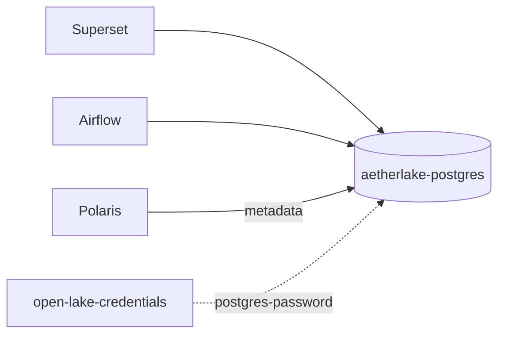

# PostgreSQL — Shared & Keycloak datastores

AetherLake runs **two separate PostgreSQL instances** on purpose. This page
documents both, what lives in each, and why Keycloak deliberately keeps its own.

| Instance | Chart | Databases | Clients |
|----------|-------|-----------|---------|
| **`aetherlake-postgres`** (shared) | `core-data-stack` | `superset`, `airflow`, `polaris` | Superset, Airflow, Polaris |
| **`keycloak-postgres`** (dedicated) | `security-stack` | `keycloak` | Keycloak only |

Both run the official `postgres:16-alpine` image as single-replica StatefulSets
with an 8Gi `ReadWriteOnce` PVC. They replaced the retired Bitnami subcharts so
the stack stays on supported, patched upstream builds.

## Shared instance — `aetherlake-postgres`

Provisioned by
[`templates/shared-datastores.yaml`](https://github.com/mrtozkl/open-lake/blob/main/helm-charts/core-data-stack/templates/shared-datastores.yaml),
gated behind `superset.enabled || airflow.enabled`. The same file also defines
the shared `aetherlake-redis` (used by Airflow/Superset as broker/cache).



### How databases get created

- A boot ConfigMap (`aetherlake-postgres-init`) runs once via the official
  postgres entrypoint and creates the `superset` and `airflow` **login roles +
  databases**, each owned by its role, all using the shared app password.
- **Polaris is different:** its own init-container connects as the `postgres`
  superuser and creates the `polaris` database + schema if missing, then
  bootstraps the realm. So `polaris` is *not* listed in the init ConfigMap — it
  is self-provisioned. See [Apache Polaris](./polaris).

### Key settings

| Setting | Default | Description |
|---------|---------|-------------|
| Image | `postgres:16-alpine` | Upstream image |
| `POSTGRES_USER` | `postgres` | Superuser (also used by Polaris) |
| Password secret | `open-lake-credentials` → `postgres-password` | Shared by superuser + app roles |
| `PGDATA` | `/var/lib/postgresql/data/pgdata` | Data dir on the PVC |
| Storage | `8Gi` RWO | `volumeClaimTemplate` |

### Connection strings (in-cluster)

```text
superset : postgresql://superset:<pw>@aetherlake-postgres:5432/superset
airflow  : postgresql://airflow:<pw>@aetherlake-postgres:5432/airflow
polaris  : jdbc:postgresql://aetherlake-postgres:5432/polaris   (user: postgres)
```

## Dedicated instance — `keycloak-postgres`

Provisioned by
[`security-stack/templates/keycloak.yaml`](https://github.com/mrtozkl/open-lake/blob/main/helm-charts/security-stack/templates/keycloak.yaml).
It hosts a single `keycloak` database, owned by the `keycloak` role, and Keycloak
connects via `jdbc:postgresql://keycloak-postgres:5432/keycloak`.

Its password comes from a **dedicated** secret key — `keycloak-db-password`, not
the shared `postgres-password` — so a leak of the data-stack credential never
exposes the identity datastore. The key is configurable via
`keycloak.postgres.passwordSecretKey` in `security-stack/values.yaml`.

## Why Keycloak keeps its own database

This is a deliberate **defense-in-depth** boundary, not an oversight. Do **not**
fold `keycloak` into the shared instance.

1. **Trust boundary.** Keycloak is the platform's root of identity — its tables
   hold password hashes, client secrets, and session tokens. The shared instance
   is reachable by Airflow (which runs **arbitrary user DAG code**) and Superset
   SQL Lab. Co-locating the auth database with services that execute
   user-supplied code dramatically widens the attack surface.
2. **Superuser reach.** Polaris connects to the shared instance as the `postgres`
   **superuser**. Within a single PostgreSQL instance, per-database grants do not
   contain a superuser — it can read every database. If `keycloak` lived there,
   any compromised superuser connection could read the entire auth store.
3. **Blast radius & lifecycle.** `security-stack` and `core-data-stack` deploy
   independently, and auth must come up before the data services can do OIDC. A
   noisy data workload (connection exhaustion, disk-fill) must not be able to
   take down login for the whole platform. Separate instances = separate failure
   domains.

The cost — one extra Postgres pod — is cheap next to the isolation it buys.

::: tip Credential boundary too
On top of the network/instance boundary, the two instances use **separate
password keys**: the shared instance reads `postgres-password`, while
`keycloak-postgres` reads its own `keycloak-db-password` (both generated
independently by `install.sh`). A leak of one credential does not expose the
other datastore.
:::

## Operations

```bash
# Shared postgres password
kubectl get secret open-lake-credentials -n aetherlake \
  -o jsonpath='{.data.postgres-password}' | base64 -d

# Keycloak postgres password (separate key)
kubectl get secret aetherlake-credentials -n aetherlake \
  -o jsonpath='{.data.keycloak-db-password}' | base64 -d

# psql into the shared instance
kubectl exec -it -n aetherlake aetherlake-postgres-0 -- \
  psql -U postgres -c '\l'

# psql into the Keycloak instance
kubectl exec -it -n aetherlake keycloak-postgres-0 -- \
  psql -U keycloak -d keycloak -c '\dt'
```

## Related

- [Apache Superset](./superset), [Apache Airflow](./airflow),
  [Apache Polaris](./polaris) — the shared-instance clients.
- [Keycloak — SSO](./keycloak) — owner of the dedicated instance.
- [Configuration Guide](../configuration) — credential secret layout.
