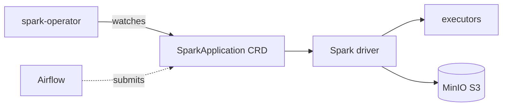

# Apache Spark — Distributed Processing

The Spark Operator runs Spark batch jobs (`SparkApplication` CRDs) for heavier
ETL than Trino is suited for. Jobs read/write directly to MinIO.

- **Chart:** `spark-operator` `1.1.27` from `kubeflow.github.io/spark-operator`
- **Job namespace:** `default`

## Architecture



## Key settings (`core-data-stack/values.yaml` → `spark-operator`)

| Setting | Default | Description |
|---------|---------|-------------|
| `spark-operator.enabled` | `true` | Toggle the operator |
| `spark-operator.sparkJobNamespace` | `default` | Namespace where `SparkApplication`s run |

## Submitting a job

Spark jobs are defined as `SparkApplication` resources, typically submitted by an
Airflow DAG (see [Data Pipelines](../pipelines)). A minimal example:

```yaml
apiVersion: sparkoperator.k8s.io/v1beta2
kind: SparkApplication
metadata:
  name: ingest
  namespace: default
spec:
  type: Python
  mode: cluster
  image: apache/spark:3.5.0
  mainApplicationFile: s3a://lakehouse/jobs/ingest.py
  sparkConf:
    spark.hadoop.fs.s3a.endpoint: http://minio-hl:9000
    spark.hadoop.fs.s3a.path.style.access: "true"
```

> The reference ingest job lives at `pipelines/spark/ingest.py`.
