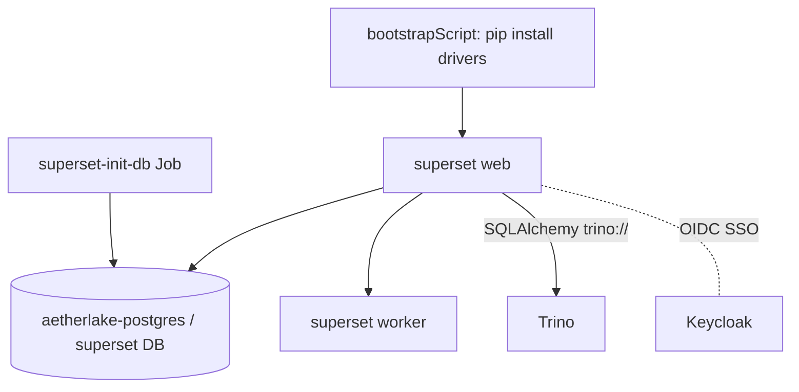

# Apache Superset — BI & Dashboards

Superset provides dashboards and SQL exploration over Trino. It runs the Apache
chart against the shared PostgreSQL, with the Trino SQLAlchemy driver installed
at boot and Keycloak OIDC SSO.

- **Chart:** `superset` `0.12.8` (Apache) → `apache/superset:3.1.2`
- **Ingress:** `superset.aetherlake.local` → `core-data-stack-superset:8088`
- **Metadata DB:** `aetherlake-postgres` / database `superset`
- **Pre-wired connection:** `Trino Analytics` → `trino://admin@core-data-stack-trino:8080/iceberg`

## Architecture



## Key settings (`core-data-stack/values.yaml` → `superset`)

| Setting | Default | Description |
|---------|---------|-------------|
| `superset.enabled` | `true` | Toggle BI |
| `superset.postgresql.enabled` | `false` | Use the shared postgres |
| `superset.bootstrapScript` | *(pip install drivers)* | Installs `sqlalchemy-trino Authlib PyJWT cryptography>=42.0.4,<43.0.0` |
| `superset.configOverrides.custom_sso` | *(OIDC config)* | Keycloak SSO via `SupersetSecurityManager` |

## Two startup gotchas (already fixed)

::: danger Pin `cryptography`
The boot driver install (`Authlib`) otherwise pulls `cryptography` 49.x, which
violates Superset 3.1.2's strict pin (`>=42.0.4,<43.0.0`). Every Superset process
then dies at import with `DistributionNotFound`. The `bootstrapScript` pins
`cryptography` into range.
:::

::: danger Custom security manager base class
The OIDC `CUSTOM_SECURITY_MANAGER` must extend
`superset.security.SupersetSecurityManager` — **not** FAB's `SecurityManager`
(Superset 3.x requirement, UPDATING.md [4565]). Extending the wrong base class
makes init-db and the web pod crash on startup.
:::

## SSO (Keycloak OIDC)

`configOverrides.custom_sso` configures `AUTH_OAUTH` against the `superset`
Keycloak client. Realm roles map to Superset roles: `data-admin → Admin`,
`data-engineer`/`data-scientist → Alpha`, others → `Gamma`.

| Setting | Value |
|---------|-------|
| Client | `superset` (secret `superset-oidc-secret` → env `SUPERSET_OIDC_SECRET`) |
| Discovery | `http://security-stack-keycloak:80/realms/aetherlake/.well-known/openid-configuration` |
| Scope | `openid profile email` |

## Operations

```bash
# Re-run DB init (db upgrade + import datasources) if needed
kubectl logs -n aetherlake job/core-data-stack-superset-init-db --tail=20

# Restart web + worker after a config change
kubectl delete pod -n aetherlake -l app=superset
```
