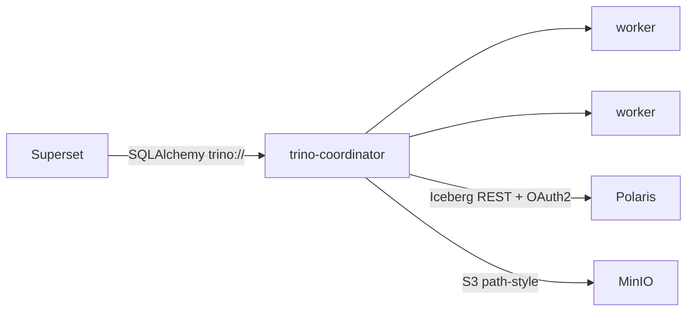

# Trino — Federated SQL Query Engine

Trino runs distributed SQL over the Iceberg catalog (Polaris) and other sources.
It is the query engine behind Superset and the Control Panel.

- **Chart:** `trino` `1.42.2` (Trino **480**) from `trinodb.github.io/charts`
- **Ingress:** `trino.aetherlake.local` → `core-data-stack-trino:8080`
- **In-cluster:** `http://core-data-stack-trino:8080`

## Architecture



## The `iceberg` catalog

Trino is pre-configured with an `iceberg` catalog backed by the Polaris REST
catalog. Key properties (`trino.additionalCatalogs.iceberg`):

```properties
connector.name=iceberg
iceberg.catalog.type=rest
iceberg.rest-catalog.uri=http://core-data-stack-polaris:8181/api/catalog
iceberg.rest-catalog.warehouse=lakehouse_catalog
iceberg.rest-catalog.security=OAUTH2
iceberg.rest-catalog.oauth2.credential=${ENV:POLARIS_CREDENTIAL}
iceberg.rest-catalog.oauth2.scope=PRINCIPAL_ROLE:ALL
iceberg.rest-catalog.vended-credentials-enabled=true
fs.native-s3.enabled=true
s3.endpoint=http://minio-hl:9000
s3.region=us-east-1
s3.path-style-access=true
```

::: tip OAuth2 scope needs Trino ≥ 458
`iceberg.rest-catalog.oauth2.scope=PRINCIPAL_ROLE:ALL` is required by Polaris but
only supported since Trino 458 — hence the chart bump to Trino 480.
:::

## Key settings (`core-data-stack/values.yaml` → `trino`)

| Setting | Default | Description |
|---------|---------|-------------|
| `trino.enabled` | `true` | Toggle Trino |
| `trino.server.workers` | `2` | Number of worker pods |
| `trino.additionalCatalogs.iceberg` | *(see above)* | Iceberg/Polaris catalog |
| `trino.additionalConfigProperties` | `["http-server.process-forwarded=true"]` | Accept ingress `X-Forwarded-*` headers (see below) |
| `trino.env[MINIO_ACCESS_KEY]` | secret `minio-root-user` | S3 access key |
| `trino.env[MINIO_SECRET_KEY]` | secret `minio-root-password` | S3 secret key |
| `trino.env[POLARIS_CREDENTIAL]` | secret `polaris-credential` | Polaris OAuth2 `id:secret` |

### Why `process-forwarded` is required

Trino runs behind the NGINX ingress, which injects `X-Forwarded-*` headers. By
default Trino's HTTP server (airlift) **rejects** forwarded requests with
`HTTP 406 — Server configuration does not allow processing of the X-Forwarded-For
header`. That breaks both the Trino web UI and the Control Panel SQL IDE, which
call `/v1/statement` through `trino.aetherlake.local`. Setting
`http-server.process-forwarded=true` (applied to the coordinator and workers via
`additionalConfigProperties`) allows those headers and resolves the 406.

## Credential vending

With `vended-credentials-enabled=true`, Trino uses the short-lived, table-scoped
S3 credentials that Polaris vends per query, instead of the static keys (which
remain as a fallback for non-vended catalog operations). See
[Polaris](./polaris).

## Try it

```bash
POD=$(kubectl get pod -n aetherlake -o name | grep trino-coordinator | head -1)
trino() { kubectl exec -n aetherlake $POD -- trino --server localhost:8080 --catalog iceberg --execute "$1"; }

trino "SHOW CATALOGS"
trino "CREATE SCHEMA IF NOT EXISTS iceberg.demo"
trino "CREATE TABLE iceberg.demo.t (id int, name varchar)"
trino "INSERT INTO iceberg.demo.t VALUES (1,'hello'),(2,'lakehouse')"
trino "SELECT * FROM iceberg.demo.t ORDER BY id"
```
