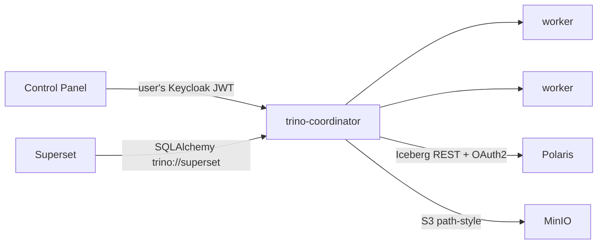

# Trino — Federated SQL Query Engine

Trino runs distributed SQL over the Iceberg catalog (Polaris) and other sources.
It is the query engine behind Superset and the Control Panel.

- **Chart:** `trino` `1.42.2` (Trino **480**) from `trinodb.github.io/charts`
- **Ingress:** `trino.aetherlake.local` → `core-data-stack-trino:8080` — the
  browser route is additionally gated by **Keycloak SSO** through oauth2-proxy
  (nginx external auth). Every request is then authenticated by Trino itself
  (`PASSWORD,JWT`), so neither the gate nor the cluster network alone grants
  anything. Behind the gate the web UI runs with the fixed service user
  (`web-ui.authentication.type=fixed`, `web-ui.user=aetherlake-ui`), which is
  intentionally **read-only**. See
  [Keycloak — SSO gate](./keycloak#sso-gate-oauth2-proxy).
- **In-cluster:** `https://core-data-stack-trino:8443` — TLS all the way;
  clients verify the AetherLake CA (see below). There is no unauthenticated
  path to the query API.

## Architecture


```mermaid
graph LR
    CP[Control Panel] -->|user's Keycloak JWT| Coord
    Superset -->|SQLAlchemy trino://superset| Coord[trino-coordinator]
    Coord --> W1[worker]
    Coord --> W2[worker]
    Coord -->|Iceberg REST + OAuth2| Polaris
    Coord -->|S3 path-style| MinIO
```

## Authentication — every query runs as a real user

Trino authenticates every request (`http-server.authentication.type=PASSWORD,JWT`);
the old trust-the-`X-Trino-User`-header mode is gone.

**JWT — interactive users.** The Control Panel forwards the logged-in user's
Keycloak access token (`Authorization: Bearer …`); Trino validates it against
the aetherlake realm and maps the principal from `preferred_username`. So a
query submitted by `alice` runs in Trino as `alice`.

- The realm RSA public key is mounted from the `trino-jwt-key` ConfigMap that
  `install.sh` fetches through the Keycloak admin API. Keycloak's JWKS
  endpoint is `http://` only while Trino fetches JWKS over `https://` only —
  hence the mounted PEM. Re-run `install.sh` after rotating realm keys.
- `http-server.authentication.jwt.required-issuer=http://keycloak.aetherlake.local/realms/aetherlake`

**PASSWORD (file authenticator) — service & dev users.** `password.db` is
rendered by `install.sh` (PBKDF2 hashes, never committed):

| User | Used by | Secret key |
|------|---------|------------|
| `control-panel-svc` | Control Panel server-side admin queries (catalog page) | `trino-panel-svc-password` |
| `superset` | Superset's Trino datasource | `trino-superset-password` |
| `mcp` | MCP server (`TRINO_BASIC_AUTH=mcp:<password>`) | `trino-mcp-password` |
| `admin`, `user` | Control Panel dev-credentials login (dev only) | `trino-dev-admin-password`, `trino-dev-user-password` |

## TLS — everything over HTTPS

Authentication is only meaningful because it is cryptographically checked,
which requires TLS — Trino serves HTTPS on **8443**:

- `aetherlake-tls.yaml` defines a cert-manager `Certificate`
  (`core-data-stack-trino`, in-cluster DNS names, `trino.aetherlake.local`,
  plus `localhost`/`127.0.0.1` for port-forward use), signed by the
  AetherLake CA. cert-manager renders a PKCS12 keystore (`keystore.p12`)
  into the `trino-tls` secret; Trino opens it with the
  `trino-keystore-password` secret key (injected by `install.sh`).
- The nginx ingress forwards to the HTTPS port
  (`backend-protocol: HTTPS`), so the browser path is TLS end to end.
- CA distribution for verification:
  - `aetherlake-ca` ConfigMap (namespace `aetherlake`) — mounted by the
    demo-data seed job (`SSL_CERT_FILE`) and readable by in-cluster clients.
  - `control-panel/.ca/aetherlake-ca.crt` — exported by `install.sh` for
    local development; the panel's Trino client pins it automatically.
  - Any other client: export the root CA and trust it
    (`NODE_EXTRA_CA_CERTS`, `REQUESTS_CA_BUNDLE`, `curl --cacert`, …).
- The plain-HTTP port (8080) remains for the chart's liveness probe and
  internal discovery only. With authentication enabled, Trino rejects
  client requests over plain HTTP (`allow-insecure-over-http` stays off),
  so no identity can be asserted without TLS.

## Authorization — per-role access control

File-based system access control (`trino.accessControl`, rules reload without
restart) + a file group provider map the Keycloak realm roles to Trino
permissions. Group membership lives in `group.db` (rendered by `install.sh` —
add new Keycloak usernames to a group line there and re-run `install.sh`).

| Group | Members | Catalogs | Notes |
|-------|---------|----------|-------|
| `data-admin` | `admin`, `control-panel-svc` | all, incl. `system` | view/kill any query; schema ownership everywhere |
| `data-engineer` | `elif` (demo), plus usernames assigned in install.sh | all except `system` | read-write; schema ownership on `iceberg` enables CREATE/DROP |
| `data-scientist` | `deniz` (demo), `user`, `superset`, `mcp`, `aetherlake-ui` | read-only, no `system` | SELECT only |

Visibility follows permissions automatically: `SHOW CATALOGS` / `SHOW SCHEMAS`
/ `SHOW TABLES` only list what the current user may touch, so the SQL IDE's
schema explorer shows each user exactly their own slice of the lakehouse.

::: tip Keycloak role → Trino group
The realm roles (`data-admin`, `data-engineer`, `data-scientist`) decide the
Control Panel UI; the same names as Trino groups decide what Trino itself
allows. Keep a user's Keycloak role and group membership in sync.
:::

## The `iceberg` catalog

Trino is pre-configured with an `iceberg` catalog backed by the Polaris REST
catalog. Key properties (`trino.additionalCatalogs.iceberg`):

```properties
connector.name=iceberg
iceberg.catalog.type=rest
iceberg.rest-catalog.uri=http://core-data-stack-polaris:8181/api/catalog
iceberg.rest-catalog.warehouse=lakehouse_catalog
iceberg.rest-catalog.security=OAUTH2
iceberg.rest-catalog.oauth2.credential=${ENV:POLARIS_CREDENTIAL}
iceberg.rest-catalog.oauth2.scope=PRINCIPAL_ROLE:ALL
iceberg.rest-catalog.vended-credentials-enabled=true
fs.native-s3.enabled=true
s3.endpoint=http://minio-hl:9000
s3.region=us-east-1
s3.path-style-access=true
```

::: tip OAuth2 scope needs Trino ≥ 458
`iceberg.rest-catalog.oauth2.scope=PRINCIPAL_ROLE:ALL` is required by Polaris but
only supported since Trino 458 — hence the chart bump to Trino 480.
:::

## The `kafka` catalog

Kafka topics are queryable as SQL tables, so data streamed by Flink SQL jobs
(e.g. the datagen → `events` pipeline) can be inspected with ordinary Trino
SQL — including from the Control Panel SQL IDE:

```sql
SELECT * FROM kafka.aetherlake.events LIMIT 10;
-- event_ts arrives as text (Flink's json format writes SQL timestamps):
SELECT parse_datetime(event_ts, 'yyyy-MM-dd HH:mm:ss.SSS') FROM kafka.aetherlake.events;
```

- Catalog properties: `trino.additionalCatalogs.kafka`
  (`kafka.nodes=aetherlake-kafka-bootstrap:9092`, `FILE` table-description
  supplier reading `/etc/trino/schemas`).
- Column schemas come from `trino.kafka.tableDescriptions` (one JSON file per
  topic, mounted by the trino subchart). Add an entry there for every new
  topic; the `events` description mirrors `pipelines/flink/examples/
  datagen-to-kafka.sql`.

## Key settings (`core-data-stack/values.yaml` → `trino`)

| Setting | Default | Description |
|---------|---------|-------------|
| `trino.enabled` | `true` | Toggle Trino |
| `trino.server.workers` | `2` | Number of worker pods |
| `trino.server.config.authenticationType` | `PASSWORD,JWT` | HTTP authentication types (see above) |
| `trino.additionalCatalogs.iceberg` | *(see above)* | Iceberg/Polaris catalog |
| `trino.additionalCatalogs.kafka` | *(see above)* | Kafka connector catalog |
| `trino.kafka.tableDescriptions` | `events.json` | Per-topic JSON schemas for the kafka catalog |
| `trino.accessControl` | file rules | Role-based catalog/schema/query rules (`rules.json`, 10s refresh) |
| `trino.auth.passwordAuth` / `trino.auth.groups` | *(install.sh)* | `password.db` / `group.db`, injected at install time |
| `trino.configMounts[trino-jwt-key]` | *(install.sh ConfigMap)* | Realm RSA public key for JWT verification |
| `trino.server.config.https` | `enabled: true`, port `8443` | HTTPS listener; keystore from the `trino-tls` secret |
| `trino.secretMounts[trino-tls]` | cert-manager secret | TLS certificate + PKCS12 keystore |
| `trino.additionalConfigProperties` | `process-forwarded` | Node-wide `config.properties` lines; coordinator-only ones (web-ui, JWT, keystore key, shared secret) are rendered by `install.sh` |
| `trino.env[MINIO_ACCESS_KEY]` | secret `minio-root-user` | S3 access key |
| `trino.env[MINIO_SECRET_KEY]` | secret `minio-root-password` | S3 secret key |
| `trino.env[POLARIS_CREDENTIAL]` | secret `polaris-credential` | Polaris OAuth2 `id:secret` |

### Why `process-forwarded` is required

Trino runs behind the NGINX ingress, which injects `X-Forwarded-*` headers. By
default Trino's HTTP server (airlift) **rejects** forwarded requests with
`HTTP 406 — Server configuration does not allow processing of the X-Forwarded-For
header`. That breaks both the Trino web UI and the Control Panel SQL IDE, which
call `/v1/statement` through `trino.aetherlake.local`. Setting
`http-server.process-forwarded=true` (applied to the coordinator and workers via
`additionalConfigProperties`) allows those headers and resolves the 406.

## Credential vending

With `vended-credentials-enabled=true`, Trino uses the short-lived, table-scoped
S3 credentials that Polaris vends per query, instead of the static keys (which
remain as a fallback for non-vended catalog operations). See
[Polaris](./polaris).

## Try it

```bash
# Trust material + tunnel to the HTTPS listener
kubectl get secret aetherlake-root-ca -n cert-manager \
  -o jsonpath='{.data.ca\.crt}' | base64 -d > /tmp/aetherlake-ca.crt
kubectl port-forward -n aetherlake svc/core-data-stack-trino 8443:8443 &

PASS=$(kubectl get secret aetherlake-credentials -n aetherlake \
  -o jsonpath='{.data.trino-mcp-password}' | base64 -d)

# Authenticated query (mcp service user, read-only):
curl -s --cacert /tmp/aetherlake-ca.crt -u "mcp:$PASS" \
  -X POST https://localhost:8443/v1/statement -d 'SHOW CATALOGS'

# Unauthenticated requests are rejected (expect a 401):
curl -s --cacert /tmp/aetherlake-ca.crt -o /dev/null -w '%{http_code}\n' \
  -X POST https://localhost:8443/v1/statement -d 'SHOW CATALOGS'
```

For multi-statement exploration (CREATE TABLE, INSERT, SELECT) use the
[Control Panel SQL IDE](../control-panel#sql-ide) — it forwards your own
Keycloak identity, so what you see there is exactly your permission slice.
